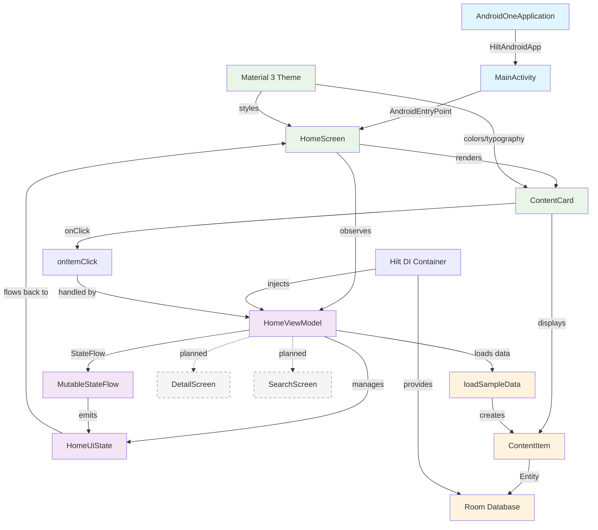
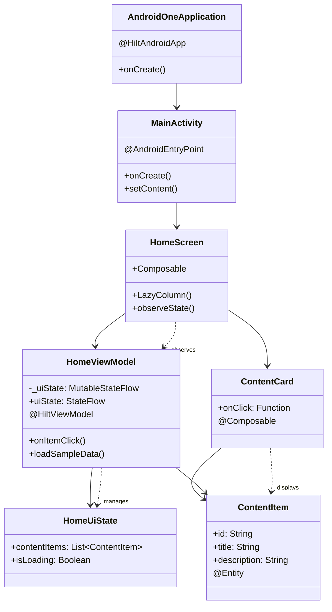
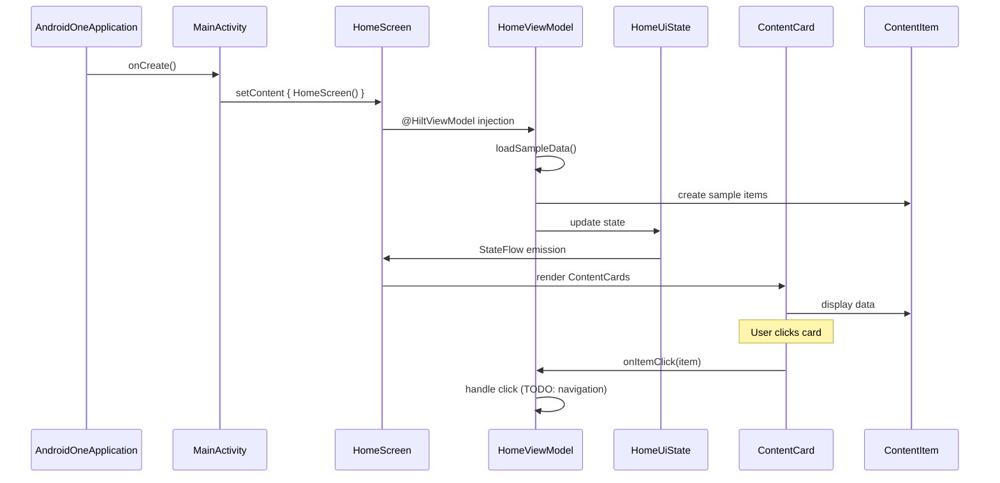

# Complete Android Development Guide for JavaScript Developers (2025)

**From Web to Mobile: Your Complete Transition Guide**

This comprehensive guide is specifically designed for experienced JavaScript developers ready to master Android development. We'll bridge the gap between your existing web development knowledge and Android's ecosystem, showing you familiar patterns and highlighting key differences.

## App Architecture Flow



## Hilt Dependency Injection Explained

The app uses **Dagger Hilt** for dependency injection following these patterns:

### 1. Application Level Setup
```kotlin
@HiltAndroidApp
class AndroidOneApplication : Application()
```
- `@HiltAndroidApp` creates the **root dependency container**
- Generates application component that serves as parent for all other components
- Entry point for the entire dependency injection graph

### 2. Activity Integration  
```kotlin
@AndroidEntryPoint
class MainActivity : ComponentActivity()
```
- `@AndroidEntryPoint` enables dependency injection for the Activity
- Creates activity-scoped component as child of application component
- Allows the Activity to access the dependency graph

### 3. ViewModel Creation
```kotlin
@HiltViewModel
class HomeViewModel @Inject constructor() : ViewModel()
```
- `@HiltViewModel` tells Hilt to manage this ViewModel's lifecycle
- `@Inject constructor()` enables Hilt to create instances
- Currently no dependencies, but ready for future injection

### 4. Compose Integration
```kotlin
@Composable
fun HomeScreen(viewModel: HomeViewModel = hiltViewModel())
```
- `hiltViewModel()` function retrieves Hilt-managed ViewModel
- Bridges Compose UI with Hilt's dependency injection
- Handles ViewModel scoping and lifecycle automatically

### 5. Dependency Injection Flow


### 6. Future Dependency Structure
The `/di` directory is prepared for modules like:

```kotlin
@Module
@InstallIn(SingletonComponent::class)
object DatabaseModule {
    @Provides
    @Singleton
    fun provideDatabase(): AppDatabase { /* ... */ }
}

@Module  
@InstallIn(ViewModelComponent::class)
abstract class RepositoryModule {
    @Binds
    abstract fun bindRepository(impl: ContentRepositoryImpl): ContentRepository
}
```

**Key Benefits:**
- **Automatic lifecycle management** for ViewModels
- **Compile-time safety** with generated code
- **Scoped dependencies** (Singleton, Activity, ViewModel scoped)
- **Easy testing** with dependency replacement

## Class Relationships and Flow



## Data Flow Pattern



## Why This Guide is Perfect for JavaScript Developers

If you're coming from **React, Vue, Angular, or Node.js**, you already understand:
- ✅ Component-based architecture
- ✅ State management patterns  
- ✅ Reactive programming concepts
- ✅ Modern build tools and dependency management
- ✅ Asynchronous programming

**We'll show you how these concepts translate directly to Android development.**

## JavaScript to Android/Kotlin: Quick Mental Model

Before diving into setup, let's establish the conceptual bridges:

### Language Comparison

| JavaScript | Kotlin | Purpose |
|------------|--------|---------|
| `const name = 'John'` | `val name = "John"` | Immutable variable |
| `let count = 0` | `var count = 0` | Mutable variable |
| `function getName() { return 'John' }` | `fun getName(): String = "John"` | Function declaration |
| `const user = { name: 'John', age: 30 }` | `data class User(val name: String, val age: Int)` | Object structure |
| `async function fetchData()` | `suspend fun fetchData()` | Asynchronous function |
| `Promise<string>` | `Flow<String>` | Reactive stream |

### Architecture Comparison

| Web Development | Android Development | Purpose |
|----------------|-------------------|---------|
| React Component | `@Composable` function | UI component |
| useState/useEffect | StateFlow/ViewModel | State management |
| Redux store | Repository pattern | Data layer |
| React Router | Navigation Component | Screen navigation |
| npm/package.json | Gradle/build.gradle.kts | Dependency management |
| Webpack/Vite | Android Gradle Plugin | Build system |
| VS Code | Android Studio | IDE |

### Lifecycle Comparison

```javascript
// React Component Lifecycle
useEffect(() => {
  // Component mounted
  fetchData()
  
  return () => {
    // Component unmounted - cleanup
  }
}, [])
```

```kotlin
// Android Composable Lifecycle
@Composable
fun MyScreen() {
  LaunchedEffect(Unit) {
    // Component mounted
    fetchData()
  }
  
  DisposableEffect(Unit) {
    onDispose {
      // Component unmounted - cleanup
    }
  }
}
```

Android Studio 2025 brings revolutionary AI-powered development tools and streamlined workflows to macOS. This comprehensive guide walks you through every step from installation to building your first modern Android app, with special focus on Mac-specific optimizations and troubleshooting.

## System requirements and preparation

Before beginning, verify your Mac meets the current requirements for optimal Android Studio 2025 performance. **Apple Silicon Macs (M1/M2/M3/M4) are strongly recommended** as Google has prioritized these platforms for future development.

**Minimum Requirements:**

- macOS 12 (Monterey) or later
- 16 GB RAM for development with emulator
- 32 GB free storage space
- Apple Silicon chip or 6th generation Intel Core processor

**Recommended Configuration:**

- macOS 15 (Sequoia) or macOS 14 (Sonoma) for best compatibility
- 32 GB RAM for optimal performance
- Latest Apple Silicon (M1/M2/M3/M4) processor
- 64 GB+ SSD storage for multiple projects

Check your system by clicking the Apple menu → About This Mac. Intel-based Macs are gradually losing support, with performance optimizations focused on Apple Silicon.

## Installing Android Studio 2025

### Download and installation process

Navigate to the official Android developer website at `developer.android.com/studio` and download the appropriate version for your Mac architecture. Android Studio automatically detects whether you need the Apple Silicon or Intel version.

**For Apple Silicon Macs:** Download "Mac with Apple chip" (recommended)
**For Intel Macs:** Download "Mac with Intel chip" (legacy support)

After downloading the DMG file:

1. **Mount the installer** by double-clicking the DMG file
2. **Drag Android Studio** into your Applications folder
3. **Launch from Applications** folder or Launchpad
4. **Handle security warnings** if prompted by going to System Preferences → Security & Privacy → General and clicking "Open Anyway"

### First launch and setup wizard

When you first launch Android Studio, you'll encounter the setup wizard. Choose "Do not import settings" for a fresh installation.

**Setup wizard configuration:**

- **Installation Type:** Select "Standard" for recommended components
- **UI Theme:** Choose between IntelliJ (light) or Darcula (dark)
- **SDK Components:** Allow the wizard to install essential components including Android SDK, build tools, and emulator
- **License Agreements:** Accept all SDK component licenses

The initial download process typically takes 15-30 minutes and installs components to `~/Library/Android/sdk/`. **Be patient during this phase** - the progress may appear stalled initially but will complete.

## Essential Android Studio Keyboard Shortcuts for Web Developers

**Coming from VS Code?** Android Studio has similar shortcuts with some key differences. Here are the essential shortcuts organized by workflow:

### Navigation & File Management
| Action | Mac Shortcut | VS Code Equivalent | Purpose |
|--------|-------------|-------------------|---------|
| Quick Open File | `Cmd + Shift + O` | `Cmd + P` | Open file by name |
| Go to Class | `Cmd + O` | `Cmd + Shift + P` → `Go to Symbol` | Find any class/interface |
| Go to Symbol | `Cmd + Alt + O` | `Cmd + Shift + O` | Find function/variable |
| Recent Files | `Cmd + E` | `Ctrl + Tab` | Switch between recent files |
| Project Tree | `Cmd + 1` | `Cmd + Shift + E` | Toggle project explorer |
| Find in Files | `Cmd + Shift + F` | `Cmd + Shift + F` | Global search |
| Navigate Back | `Cmd + Alt + ←` | `Ctrl + -` | Go to previous location |
| Navigate Forward | `Cmd + Alt + →` | `Ctrl + Shift + -` | Go to next location |

### Code Editing & Refactoring
| Action | Mac Shortcut | VS Code Equivalent | Purpose |
|--------|-------------|-------------------|---------|
| Auto Complete | `Ctrl + Space` | `Ctrl + Space` | IntelliSense |
| Quick Fix | `Alt + Enter` | `Cmd + .` | Show code actions |
| Rename Symbol | `Shift + F6` | `F2` | Rename variable/function |
| Extract Method | `Cmd + Alt + M` | N/A (Extension needed) | Extract to function |
| Extract Variable | `Cmd + Alt + V` | N/A | Extract to variable |
| Format Code | `Cmd + Alt + L` | `Shift + Alt + F` | Auto-format file |
| Optimize Imports | `Ctrl + Alt + O` | N/A | Remove unused imports |
| Duplicate Line | `Cmd + D` | `Shift + Alt + ↓` | Copy current line |
| Move Line Up/Down | `Alt + Shift + ↑/↓` | `Alt + ↑/↓` | Move current line |

### Build & Run
| Action | Mac Shortcut | Purpose |
|--------|-------------|---------|
| Build Project | `Cmd + F9` | Compile the project |
| Run App | `Ctrl + R` | Run on device/emulator |
| Debug App | `Ctrl + D` | Start debugging session |
| Stop App | `Cmd + F2` | Stop running application |
| Clean Project | N/A (Menu only) | Clean build cache |

### Debugging (Similar to Browser DevTools)
| Action | Mac Shortcut | Browser DevTools | Purpose |
|--------|-------------|-----------------|---------|
| Toggle Breakpoint | `Cmd + F8` | Click line number | Add/remove breakpoint |
| Step Over | `F8` | `F10` | Execute next line |
| Step Into | `F7` | `F11` | Step into function |
| Step Out | `Shift + F8` | `Shift + F11` | Step out of function |
| Resume | `Cmd + Alt + R` | `F8` | Continue execution |
| Evaluate Expression | `Alt + F8` | Console tab | Debug expressions |

### Android-Specific Shortcuts
| Action | Mac Shortcut | Purpose |
|--------|-------------|---------|
| Sync Project | `Cmd + Shift + A` → "Sync" | Refresh Gradle dependencies |
| AVD Manager | `Cmd + Shift + A` → "AVD" | Manage virtual devices |
| Logcat | `Cmd + 6` | View device logs |
| Layout Inspector | `Cmd + Shift + A` → "Layout Inspector" | Inspect UI hierarchy |

### Pro Tips for Web Developers
1. **Enable Key Promoter X**: Install this plugin to learn shortcuts faster
2. **Customize Keymap**: Go to `Preferences → Keymap` to match your VS Code habits
3. **Live Templates**: Like VS Code snippets - type `fori` + Tab for for-loop
4. **Multiple Cursors**: `Alt + Click` just like VS Code
5. **Search Everywhere**: `Double Shift` - finds anything (files, classes, actions)

## Initial setup and configuration

### Java and JDK setup

Android Studio 2025 includes a **bundled JetBrains Runtime (JBR)** that eliminates the need for separate Java installation. This optimized JDK handles all compatibility requirements automatically.

If you need to set JAVA_HOME for command-line tools:

```bash
# Add to ~/.zshrc or ~/.bash_profile
export JAVA_HOME="/Applications/Android Studio.app/Contents/jbr/Contents/Home"
export PATH=$PATH:$JAVA_HOME/bin
source ~/.zshrc
```

### Essential environment variables

Configure your development environment by adding these variables to your shell profile:

```bash
# Android SDK paths
export ANDROID_HOME=/Users/$USER/Library/Android/sdk
export PATH=$PATH:$ANDROID_HOME/emulator
export PATH=$PATH:$ANDROID_HOME/tools
export PATH=$PATH:$ANDROID_HOME/platform-tools
```

### Performance optimization

Optimize Android Studio for your Mac by configuring custom VM options:

1. Go to **Help → Edit Custom VM Options**
2. Add these optimizations:

```bash
-Xms2048m
-Xmx8192m
-XX:ReservedCodeCacheSize=1024m
-XX:+UseConcMarkSweepGC
-XX:SoftRefLRUPolicyMSPerMB=50
-Dsun.java2d.opengl=true
```

## Creating your first modern Android project

### Project creation workflow

Create a new project using Android Studio's latest templates optimized for 2025 development:

1. **Launch Android Studio** and click "New Project"
2. **Select Template:** Choose "Empty Compose Activity" (recommended for modern development)
3. **Configure Project Details:**
   - **Name:** Your app name
   - **Package Name:** Use reverse domain notation (com.yourcompany.appname)
   - **Language:** Kotlin (strongly recommended)
   - **Minimum API Level:** API 24 (Android 7.0) for 97% device coverage
   - **Build Configuration:** Kotlin DSL (build.gradle.kts)

### 2025 configuration settings

Configure your project for current Android development standards:

- **Target SDK:** API 36 (Android 16) for 2025 compliance
- **Compile SDK:** API 36
- **Kotlin Version:** 1.9.22+
- **Android Gradle Plugin:** 8.6+
- **Gradle Version:** 8.7+

The project creation process automatically configures these modern dependencies:

```kotlin
// Compose BOM for consistent versions
implementation(platform("androidx.compose:compose-bom:2025.04.01"))
implementation("androidx.compose.ui:ui")
implementation("androidx.compose.material3:material3")
implementation("androidx.activity:activity-compose:1.8.2")
implementation("androidx.lifecycle:lifecycle-viewmodel-compose:2.7.0")
```

## Development environment configuration

### SDK Manager setup

Access the SDK Manager through **Tools → SDK Manager** and install these essential components:

**SDK Platforms:**

- Android 16 (API level 36) - latest target
- Android 14 (API level 34) - broad compatibility
- Android 7.0 (API level 24) - minimum support

**SDK Tools:**

- Android SDK Build-Tools 35.0.0+
- Android Emulator (latest version)
- Android SDK Platform-Tools
- Intel x86 Emulator Accelerator (Intel Macs only)

### Development Workflow: From npm to Gradle

**Coming from Node.js?** Here's how Android's build system compares to what you know:

#### Build System Comparison

| Web Development | Android Development | Purpose |
|----------------|-------------------|---------|
| `package.json` | `build.gradle.kts` | Project configuration |
| `npm install` | Gradle Sync | Install dependencies |
| `npm run dev` | Run App | Start development server |
| `npm run build` | Build APK | Create production build |
| `node_modules/` | `.gradle/` cache | Downloaded dependencies |
| `npm scripts` | Gradle tasks | Custom build commands |

#### Key Differences for JS Developers

**1. Dependency Management:**
```javascript
// package.json (familiar)
{
  "dependencies": {
    "react": "^18.0.0",
    "axios": "^1.0.0"
  }
}
```

```kotlin
// build.gradle.kts (new)
dependencies {
    implementation("androidx.compose.ui:ui:1.5.0")
    implementation("com.squareup.retrofit2:retrofit:2.9.0")
}
```

**2. Development Server vs Emulator:**
- **Web**: `npm run dev` starts local server at `localhost:3000`
- **Android**: Click ▶️ builds app and deploys to emulator/device

**3. Hot Reload:**
- **Web**: Save file → Browser auto-refreshes
- **Android**: Save file → Auto-deploys to device (with Live Edit)

### Gradle Configuration (Think webpack.config.js)

Android Studio 2025 uses Gradle 8.7+ with performance improvements. Configure your `gradle.properties` file for optimal build performance:

```properties
# Similar to webpack optimization settings
org.gradle.jvmargs=-Xmx4096m -XX:+UseParallelGC
org.gradle.daemon=true
org.gradle.parallel=true
org.gradle.configureondemand=true
android.useAndroidX=true
```

**For JavaScript developers**: This is like your `webpack.config.js` performance optimizations, but for Android builds.

## Building the AndroidOne app example

Now let's create a modern Android application called AndroidOne using current best practices and architecture patterns.

### Project Structure: React/Vue to Android Translation

**Coming from React or Vue?** Here's how Android project structure maps to what you know:

#### Web vs Android Project Structure

| Web Project (React/Vue) | Android Project | Purpose |
|------------------------|----------------|---------|
| `src/components/` | `ui/screens/` & `ui/components/` | Reusable UI components |
| `src/pages/` or `src/views/` | `ui/screens/` | Full screen components |
| `src/services/` or `src/api/` | `data/remote/` | API calls and networking |
| `src/store/` or `src/state/` | `data/repository/` | State management |
| `src/models/` or `src/types/` | `domain/model/` | Data structures |
| `src/utils/` or `src/helpers/` | `domain/usecase/` | Business logic |
| `src/assets/` | `res/` folder | Images, fonts, static files |
| `package.json` dependencies | `build.gradle.kts` dependencies | External libraries |

#### Complete AndroidOne Project Structure

```
app/
├── src/main/
│   ├── java/com/rr/adone/           # Like src/ in React
│   │   ├── ui/                      # Frontend layer (like components/)
│   │   │   ├── screens/             # Pages/Views
│   │   │   │   ├── home/            # Home page components
│   │   │   │   ├── detail/          # Detail page components
│   │   │   │   └── search/          # Search page components
│   │   │   ├── components/          # Reusable UI components
│   │   │   └── theme/               # Styling (like CSS theme)
│   │   ├── data/                    # Backend layer (like services/)
│   │   │   ├── repository/          # Data management (like Redux store)
│   │   │   ├── remote/              # API calls (like axios services)
│   │   │   └── local/               # Local storage (like localStorage)
│   │   ├── domain/                  # Business logic (like utils/)
│   │   │   ├── model/               # Data types (like TypeScript interfaces)
│   │   │   └── usecase/             # Business rules (like custom hooks)
│   │   └── di/                      # Dependency injection (like context providers)
│   ├── res/                         # Static assets (like public/ or assets/)
│   │   ├── drawable/                # Images (like images/)
│   │   ├── values/                  # Constants (like constants.js)
│   │   └── layout/                  # XML layouts (rarely used with Compose)
│   └── AndroidManifest.xml          # App configuration (like index.html + manifest)
├── build.gradle.kts                 # Package configuration (like package.json)
└── proguard-rules.pro              # Build optimization (like webpack optimization)
```

#### Key Differences for Web Developers

**1. Resource Management:**
- **Web**: Images in `public/images/`, imported with `import logo from './logo.png'`
- **Android**: Images in `res/drawable/`, referenced with `R.drawable.logo`

**2. Configuration:**
- **Web**: Environment variables in `.env` files
- **Android**: Configuration in `AndroidManifest.xml` and `build.gradle.kts`

**3. Routing/Navigation:**
- **Web**: React Router with URL paths
- **Android**: Navigation Component with screen destinations

**4. Styling:**
- **Web**: CSS files or styled-components
- **Android**: Material Theme system with `ui/theme/` folder

## Step-by-Step Implementation Guide: From Concept to Code

**Ready to build AndroidOne?** Here's the exact step-by-step process with keyboard shortcuts:

### Prerequisites Setup

#### 1. **Create New Project (5 minutes)**

**Step 1**: Launch Android Studio
- **Mac**: `Cmd + Space` → type "Android Studio" → `Enter`

**Step 2**: Create new project
- Click **"New Project"** or `Cmd + Shift + N`
- Select **"Empty Compose Activity"**
- **Project Details**:
  - **Name**: `AndroidOne`
  - **Package**: `com.rr.adone`
  - **Language**: `Kotlin`
  - **Minimum SDK**: `API 24`
  - **Build Config**: `Kotlin DSL`
- Click **"Finish"**

**Step 3**: Wait for initial sync (2-3 minutes)
- Watch bottom status bar for "Gradle sync" completion

### Core AndroidOne Implementation

#### Step 1: Create the ContentItem Data Class (2 minutes)

**Step 1**: Create domain model directory structure
- **Navigate**: `Cmd + 1` (Project panel)
- **Right-click** `app/src/main/java/com.rr.adone`
- Select **"New → Package"** or `Cmd + N`
- Type: `domain` → `Enter`
- **Right-click** the new `domain` package
- Select **"New → Package"** or `Cmd + N`  
- Type: `model` → `Enter`

**Step 2**: Create ContentItem.kt file
- **Right-click** `domain.model` package
- Select **"New → Kotlin Class/File"** or `Cmd + N`
- Select **"File"**
- Type: `ContentItem` → `Enter`

**Step 3**: Write the code
- **Quick template**: Type `data` + `Tab` (live template)
- **Or manually type**:

```kotlin
package com.rr.adone.domain.model

data class ContentItem(
    val id: String,
    val title: String,
    val description: String
)
```

**Step 4**: Format and optimize
- **Format code**: `Cmd + Alt + L`
- **Optimize imports**: `Ctrl + Alt + O`
- **Save**: `Cmd + S`

#### Step 2: Create the HomeUiState Data Class (2 minutes)

**Step 1**: Navigate to home screen package
- **Quick open**: `Cmd + Shift + O`
- Type: `HomeScreen` → `Enter` (if it exists)
- **Or navigate**: `Cmd + 1` → `app/src/main/java/com.rr.adone/ui/screens/home`

**Step 2**: Create HomeUiState.kt
- **Right-click** `ui.screens.home` package (create if needed)
- **New file**: `Cmd + N` → **"File"**
- Type: `HomeUiState` → `Enter`

**Step 3**: Write the code with shortcuts
- **Import ContentItem**: `Alt + Enter` on unresolved reference
- **Auto-complete**: `Ctrl + Space` for suggestions

```kotlin
package com.rr.adone.ui.screens.home

import com.rr.adone.domain.model.ContentItem

data class HomeUiState(
    val items: List<ContentItem> = emptyList(),
    val isLoading: Boolean = false,
    val error: String? = null
)
```

**Step 4**: Format and save
- **Format**: `Cmd + Alt + L`
- **Save**: `Cmd + S`

#### Step 3: Create the HomeViewModel (5 minutes)

**Step 1**: Create HomeViewModel.kt in same package
- **Right-click** `ui.screens.home`
- **New file**: `Cmd + N` → **"File"**
- Type: `HomeViewModel` → `Enter`

**Step 2**: Write class signature with live templates
- Type: `class` + `Tab` (live template)
- **Or manually**:

```kotlin
package com.rr.adone.ui.screens.home

import androidx.lifecycle.ViewModel
import androidx.lifecycle.viewModelScope
import com.rr.adone.domain.model.ContentItem
import dagger.hilt.android.lifecycle.HiltViewModel
import kotlinx.coroutines.flow.MutableStateFlow
import kotlinx.coroutines.flow.StateFlow
import kotlinx.coroutines.flow.asStateFlow
import kotlinx.coroutines.launch
import javax.inject.Inject

@HiltViewModel
class HomeViewModel @Inject constructor() : ViewModel() {
    
    private val _uiState = MutableStateFlow(HomeUiState())
    val uiState: StateFlow<HomeUiState> = _uiState.asStateFlow()
    
    init {
        loadSampleData()
    }
    
    private fun loadSampleData() {
        viewModelScope.launch {
            _uiState.value = _uiState.value.copy(isLoading = true)
            
            // Sample data for demonstration
            val sampleItems = listOf(
                ContentItem("1", "Android Development", "Learn modern Android development with Jetpack Compose"),
                ContentItem("2", "Kotlin Programming", "Master Kotlin for Android development"),
                ContentItem("3", "Material Design", "Implement beautiful Material 3 designs"),
                ContentItem("4", "Architecture Patterns", "MVVM and Clean Architecture best practices"),
                ContentItem("5", "Testing", "Unit and UI testing strategies")
            )
            
            _uiState.value = _uiState.value.copy(
                items = sampleItems,
                isLoading = false
            )
        }
    }
    
    fun onItemClick(item: ContentItem) {
        // Handle item click - navigate to detail screen, etc.
        // This is where you would typically navigate to a detail screen
    }
}
```

**Step 3**: Fix imports with shortcuts
- **Auto-import**: `Alt + Enter` on red underlined code
- **Quick fix**: `Alt + Enter` → select correct import
- **Import all**: `Ctrl + Alt + O` (optimize imports)

**Step 4**: Format and save
- **Format**: `Cmd + Alt + L`
- **Save**: `Cmd + S`

#### Step 4: Create the ContentCard Composable (7 minutes)

**Step 1**: Create ContentCard.kt
- **Right-click** `ui.screens.home`
- **New file**: `Cmd + N` → **"File"**
- Type: `ContentCard` → `Enter`

**Step 2**: Start with Composable template
- Type: `@Composable` + `Enter`
- **Function template**: Type `fun` + `Tab`

**Step 3**: Write the complete composable

```kotlin
package com.rr.adone.ui.screens.home

import androidx.compose.foundation.clickable
import androidx.compose.foundation.layout.Column
import androidx.compose.foundation.layout.Spacer
import androidx.compose.foundation.layout.fillMaxWidth
import androidx.compose.foundation.layout.height
import androidx.compose.foundation.layout.padding
import androidx.compose.material3.Card
import androidx.compose.material3.CardDefaults
import androidx.compose.material3.MaterialTheme
import androidx.compose.material3.Text
import androidx.compose.runtime.Composable
import androidx.compose.ui.Modifier
import androidx.compose.ui.text.style.TextOverflow
import androidx.compose.ui.tooling.preview.Preview
import androidx.compose.ui.unit.dp
import com.rr.adone.domain.model.ContentItem

@Composable
fun ContentCard(
    item: ContentItem,
    onClick: () -> Unit
) {
    Card(
        modifier = Modifier
            .fillMaxWidth()
            .clickable { onClick() },
        elevation = CardDefaults.cardElevation(defaultElevation = 4.dp)
    ) {
        Column(
            modifier = Modifier.padding(16.dp)
        ) {
            Text(
                text = item.title,
                style = MaterialTheme.typography.headlineSmall,
                maxLines = 2,
                overflow = TextOverflow.Ellipsis
            )

            Spacer(modifier = Modifier.height(8.dp))

            Text(
                text = item.description,
                style = MaterialTheme.typography.bodyMedium,
                maxLines = 3,
                overflow = TextOverflow.Ellipsis
            )
        }
    }
}

@Preview(showBackground = true)
@Composable
fun ContentCardPreview() {
    MaterialTheme {
        ContentCard(
            item = ContentItem(
                id = "1",
                title = "Sample Title",
                description = "This is a sample description for the content card preview."
            ),
            onClick = { }
        )
    }
}
```

**Step 4**: Use shortcuts for efficiency
- **Auto-complete**: `Ctrl + Space` while typing
- **Quick documentation**: `F1` on any function/class
- **Parameter info**: `Cmd + P` inside function calls
- **Auto-import**: `Alt + Enter` for unresolved references

**Step 5**: Preview your component
- **Split view**: Click **"Split"** button in top-right
- **Or**: `Cmd + Shift + F12` (toggle maximized)
- **Refresh preview**: Click refresh icon or `Cmd + R`

#### Step 5: Create the HomeScreen Composable (10 minutes)

**Step 1**: Create HomeScreen.kt
- **Right-click** `ui.screens.home`
- **New file**: `Cmd + N` → **"File"**
- Type: `HomeScreen` → `Enter`

**Step 2**: Implement HomeScreen with advanced patterns

```kotlin
package com.rr.adone.ui.screens.home

import androidx.compose.foundation.layout.Arrangement
import androidx.compose.foundation.layout.Box
import androidx.compose.foundation.layout.PaddingValues
import androidx.compose.foundation.layout.fillMaxSize
import androidx.compose.foundation.lazy.LazyColumn
import androidx.compose.foundation.lazy.items
import androidx.compose.material3.CircularProgressIndicator
import androidx.compose.material3.MaterialTheme
import androidx.compose.material3.Text
import androidx.compose.runtime.Composable
import androidx.compose.runtime.collectAsState
import androidx.compose.runtime.getValue
import androidx.compose.ui.Alignment
import androidx.compose.ui.Modifier
import androidx.compose.ui.unit.dp
import androidx.hilt.navigation.compose.hiltViewModel

@Composable
fun HomeScreen(
    viewModel: HomeViewModel = hiltViewModel()
) {
    val uiState by viewModel.uiState.collectAsState()

    when {
        uiState.isLoading -> {
            Box(
                modifier = Modifier.fillMaxSize(),
                contentAlignment = Alignment.Center
            ) {
                CircularProgressIndicator()
            }
        }
        
        uiState.error != null -> {
            Box(
                modifier = Modifier.fillMaxSize(),
                contentAlignment = Alignment.Center
            ) {
                Text(
                    text = "Error: ${uiState.error}",
                    style = MaterialTheme.typography.bodyLarge,
                    color = MaterialTheme.colorScheme.error
                )
            }
        }
        
        else -> {
            LazyColumn(
                modifier = Modifier.fillMaxSize(),
                contentPadding = PaddingValues(16.dp),
                verticalArrangement = Arrangement.spacedBy(12.dp)
            ) {
                items(uiState.items) { item ->
                    ContentCard(
                        item = item,
                        onClick = { viewModel.onItemClick(item) }
                    )
                }
            }
        }
    }
}
```

**Step 3**: Use advanced editing shortcuts
- **Duplicate line**: `Cmd + D`
- **Move line up/down**: `Alt + Shift + ↑/↓`
- **Select next occurrence**: `Ctrl + G`
- **Multi-cursor**: `Alt + Click`
- **Expand selection**: `Alt + ↑`
- **Shrink selection**: `Alt + ↓`

### Project Configuration and Dependencies (10 minutes)

#### Step 6: Update build.gradle.kts Files

**Step 1**: Open project-level build.gradle.kts
- **Quick open**: `Cmd + Shift + O`
- Type: `build.gradle.kts` → Select project-level file

**Step 2**: Add Hilt plugin
- **Find in file**: `Cmd + F` → search "plugins"
- **Add line**: Position cursor at end of plugins block
- **New line**: `Enter`
- **Add**: `id("com.google.dagger.hilt.android") version "2.48" apply false`

**Step 3**: Open app-level build.gradle.kts
- **Quick open**: `Cmd + Shift + O`
- Type: `build.gradle.kts` → Select app module file

**Step 4**: Add plugins and dependencies
- **Find**: `Cmd + F` → search "plugins"
- **Add lines** after existing plugins:
```kotlin
id("kotlin-kapt")
id("dagger.hilt.android.plugin")
```

- **Find**: `Cmd + F` → search "dependencies"
- **Add** before closing brace:
```kotlin
// ViewModel and LiveData
implementation("androidx.lifecycle:lifecycle-viewmodel-compose:2.7.0")
implementation("androidx.lifecycle:lifecycle-runtime-compose:2.7.0")

// Dependency injection
implementation("com.google.dagger:hilt-android:2.48")
kapt("com.google.dagger:hilt-compiler:2.48")
implementation("androidx.hilt:hilt-navigation-compose:1.1.0")
```

#### Step 7: Create Application Class

**Step 1**: Create AndroidOneApplication.kt
- **Right-click** main package `com.rr.adone`
- **New file**: `Cmd + N` → **"File"**
- Type: `AndroidOneApplication` → `Enter`

**Step 2**: Write Application class
```kotlin
package com.rr.adone

import android.app.Application
import dagger.hilt.android.HiltAndroidApp

@HiltAndroidApp
class AndroidOneApplication : Application()
```

#### Step 8: Update AndroidManifest.xml

**Step 1**: Open AndroidManifest.xml
- **Quick open**: `Cmd + Shift + O`
- Type: `AndroidManifest.xml` → `Enter`

**Step 2**: Add application name
- **Find**: `Cmd + F` → search "application"
- **Add attribute** to `<application>` tag:
```xml
android:name=".AndroidOneApplication"
```

#### Step 9: Update MainActivity

**Step 1**: Open MainActivity.kt
- **Quick open**: `Cmd + Shift + O`
- Type: `MainActivity` → `Enter`

**Step 2**: Replace content with HomeScreen integration
```kotlin
package com.rr.adone

import android.os.Bundle
import androidx.activity.ComponentActivity
import androidx.activity.compose.setContent
import androidx.activity.enableEdgeToEdge
import androidx.compose.foundation.layout.fillMaxSize
import androidx.compose.foundation.layout.padding
import androidx.compose.material3.Scaffold
import androidx.compose.ui.Modifier
import com.rr.adone.ui.screens.home.HomeScreen
import com.rr.adone.ui.theme.AdoneTheme
import dagger.hilt.android.AndroidEntryPoint

@AndroidEntryPoint
class MainActivity : ComponentActivity() {
    override fun onCreate(savedInstanceState: Bundle?) {
        super.onCreate(savedInstanceState)
        enableEdgeToEdge()
        setContent {
            AdoneTheme {
                Scaffold(modifier = Modifier.fillMaxSize()) { innerPadding ->
                    HomeScreen(
                        modifier = Modifier.padding(innerPadding)
                    )
                }
            }
        }
    }
}
```

### Build and Run (5 minutes)

#### Step 10: Sync and Build Project

**Step 1**: Sync project
- **Gradle sync**: `Cmd + Shift + A` → type "sync" → select "Sync Project with Gradle Files"
- **Or**: Click **"Sync Now"** banner if visible

**Step 2**: Build project
- **Build**: `Cmd + F9`
- **Or**: `Build → Make Project`

**Step 3**: Fix any errors
- **View errors**: `Cmd + 6` (Problems panel)
- **Jump to error**: `F2` (next error)
- **Quick fix**: `Alt + Enter`

#### Step 11: Run the App

**Step 1**: Set up emulator (if needed)
- **AVD Manager**: `Cmd + Shift + A` → type "AVD Manager"
- **Create Virtual Device** → Select device → Download system image

**Step 2**: Run application
- **Run app**: `Ctrl + R`
- **Or**: Click green ▶️ button
- **Select target**: Choose emulator or connected device

**Step 3**: Debug if needed
- **Debug mode**: `Ctrl + D`
- **View logs**: `Cmd + 6` (Logcat)
- **Set breakpoint**: Click line number

### Productivity Shortcuts During Development

#### Essential Code Navigation
- **Go to class**: `Cmd + O`
- **Go to file**: `Cmd + Shift + O`
- **Go to symbol**: `Cmd + Alt + O`
- **Recent files**: `Cmd + E`
- **Go to declaration**: `Cmd + B`
- **Go to implementation**: `Cmd + Alt + B`
- **Find usages**: `Alt + F7`

#### Code Editing Power Moves
- **Extract method**: `Cmd + Alt + M`
- **Extract variable**: `Cmd + Alt + V`
- **Inline**: `Cmd + Alt + N`
- **Rename**: `Shift + F6`
- **Safe delete**: `Cmd + Delete`
- **Copy reference**: `Cmd + Alt + Shift + C`

#### Live Templates for Speed
- **Type shortcuts + Tab**:
  - `fun` → function template
  - `fori` → for loop with index
  - `fore` → for each loop
  - `sout` → println()
  - `psvm` → main method
  - `@Composable` → composable function

#### Debugging Shortcuts
- **Toggle breakpoint**: `Cmd + F8`
- **Step over**: `F8`
- **Step into**: `F7`
- **Step out**: `Shift + F8`
- **Resume**: `Cmd + Alt + R`
- **Evaluate expression**: `Alt + F8`

### Verification Steps

#### Step 12: Test Your Implementation

**Visual verification**:
1. App launches without crashes
2. Home screen displays 5 sample cards
3. Cards show title and description
4. Loading state works (briefly visible)
5. Compose preview renders correctly

**Code verification**:
- **No red underlines** in any file
- **Build succeeds**: `Cmd + F9`
- **All imports resolved**: `Ctrl + Alt + O`

**Quick test checklist**:
- ✅ Project builds successfully
- ✅ App runs on emulator/device  
- ✅ Home screen displays content cards
- ✅ No runtime errors in Logcat
- ✅ Hilt dependency injection works

Congratulations! You've successfully implemented the AndroidOne app using modern Android development practices with maximum efficiency through keyboard shortcuts.

### Android Studio IDE Features: VS Code Developer's Guide

**Familiar with VS Code extensions?** Android Studio has built-in equivalents and more:

#### Feature Comparison

| VS Code Feature | Android Studio Equivalent | How to Access |
|----------------|---------------------------|---------------|
| **File Explorer** | Project View | `Cmd + 1` |
| **Integrated Terminal** | Terminal View | `Alt + F12` |
| **Search & Replace** | Find in Files | `Cmd + Shift + F` |
| **Git Integration** | VCS Menu | `Cmd + 9` (Git tab) |
| **IntelliSense** | Code Completion | `Ctrl + Space` |
| **Prettier/ESLint** | Code Formatter | `Cmd + Alt + L` |
| **Live Server** | Live Edit | Automatic on save |
| **Debugger** | Android Debugger | `Ctrl + D` |
| **Extensions** | Plugins | `Preferences → Plugins` |

#### Unique Android Studio Features (Not in VS Code)

**1. Layout Inspector** - Like Browser DevTools for Android UI
- Access: `Tools → Layout Inspector`
- Purpose: Inspect UI hierarchy, view properties, measure layouts
- **Web equivalent**: Browser DevTools Elements tab

**2. Logcat** - Like Browser Console but for Android
- Access: `Cmd + 6` or bottom panel
- Purpose: View app logs, errors, debug messages
- **Web equivalent**: Browser Console tab

**3. Device Manager (AVD)** - Like browser selection for testing
- Access: `Tools → Device Manager`
- Purpose: Create and manage virtual devices
- **Web equivalent**: Responsive design mode + device selection

**4. APK Analyzer** - Like bundle analyzer for web apps
- Access: `Build → Analyze APK`
- Purpose: Analyze app size, see what's taking up space
- **Web equivalent**: webpack-bundle-analyzer

**5. Profiler** - Like Performance tab in DevTools
- Access: `View → Tool Windows → Profiler`
- Purpose: Monitor CPU, memory, network usage
- **Web equivalent**: Browser Performance/Network tabs

#### Essential Plugins for Web Developers

Install these plugins to make Android Studio feel more like VS Code:

1. **Key Promoter X** - Shows shortcuts for actions (like VS Code)
2. **Rainbow Brackets** - Colorize brackets (like Bracket Pair Colorizer)
3. **GitToolBox** - Enhanced Git integration
4. **Kotlin Fill Class** - Auto-generate boilerplate code
5. **Compose Colors Preview** - See colors inline (like CSS color preview)

#### Step 2: Create the UI state data class

Create a UI state class to manage the screen state:

**File: `app/src/main/java/com/rr/adone/ui/screens/home/HomeUiState.kt`**

```kotlin
package com.rr.adone.ui.screens.home

import com.rr.adone.domain.model.ContentItem

data class HomeUiState(
    val items: List<ContentItem> = emptyList(),
    val isLoading: Boolean = false,
    val error: String? = null
)
```

#### Step 3: State Management - From React/Redux to Android ViewModels

**Coming from React or Redux?** Here's how Android's state management compares:

##### State Management Comparison

| Web Pattern | Android Pattern | Purpose |
|------------|----------------|---------|
| `useState()` | `MutableStateFlow` | Local component state |
| `useEffect()` | `LaunchedEffect()` | Side effects |
| Redux store | Repository + ViewModel | Global state management |
| Context API | Hilt Dependency Injection | Share data across components |
| Custom hooks | ViewModels | Reusable stateful logic |

##### React vs Android ViewModel Examples

**React Component with State:**
```javascript
function HomeComponent() {
  const [items, setItems] = useState([])
  const [loading, setLoading] = useState(false)
  
  useEffect(() => {
    setLoading(true)
    fetchItems().then(data => {
      setItems(data)
      setLoading(false)
    })
  }, [])
  
  return (
    <div>
      {loading ? <Spinner /> : <ItemList items={items} />}
    </div>
  )
}
```

**Android Equivalent with ViewModel:**
```kotlin
@HiltViewModel
class HomeViewModel @Inject constructor() : ViewModel() {
    private val _uiState = MutableStateFlow(HomeUiState())
    val uiState = _uiState.asStateFlow()
    
    init {
        loadItems()
    }
    
    private fun loadItems() {
        viewModelScope.launch {
            _uiState.value = _uiState.value.copy(isLoading = true)
            val items = fetchItems()
            _uiState.value = _uiState.value.copy(
                items = items,
                isLoading = false
            )
        }
    }
}
```

##### Key Differences for JavaScript Developers:

1. **Immutable Updates**: Like Redux, always create new state objects
2. **Reactive Streams**: StateFlow is like RxJS Observables
3. **Lifecycle Aware**: ViewModels survive screen rotations (unlike React state)
4. **Dependency Injection**: Hilt provides dependencies (like React Context)

#### Step 3: Create the ViewModel

Implement the ViewModel to handle business logic:

**File: `app/src/main/java/com/rr/adone/ui/screens/home/HomeViewModel.kt`**

```kotlin
package com.rr.adone.ui.screens.home

import androidx.lifecycle.ViewModel
import androidx.lifecycle.viewModelScope
import com.rr.adone.domain.model.ContentItem
import dagger.hilt.android.lifecycle.HiltViewModel
import kotlinx.coroutines.flow.MutableStateFlow
import kotlinx.coroutines.flow.StateFlow
import kotlinx.coroutines.flow.asStateFlow
import kotlinx.coroutines.launch
import javax.inject.Inject

@HiltViewModel
class HomeViewModel @Inject constructor() : ViewModel() {
    
    private val _uiState = MutableStateFlow(HomeUiState())
    val uiState: StateFlow<HomeUiState> = _uiState.asStateFlow()
    
    init {
        loadSampleData()
    }
    
    private fun loadSampleData() {
        viewModelScope.launch {
            _uiState.value = _uiState.value.copy(isLoading = true)
            
            // Sample data for demonstration
            val sampleItems = listOf(
                ContentItem("1", "Android Development", "Learn modern Android development with Jetpack Compose"),
                ContentItem("2", "Kotlin Programming", "Master Kotlin for Android development"),
                ContentItem("3", "Material Design", "Implement beautiful Material 3 designs"),
                ContentItem("4", "Architecture Patterns", "MVVM and Clean Architecture best practices"),
                ContentItem("5", "Testing", "Unit and UI testing strategies")
            )
            
            _uiState.value = _uiState.value.copy(
                items = sampleItems,
                isLoading = false
            )
        }
    }
    
    fun onItemClick(item: ContentItem) {
        // Handle item click - navigate to detail screen, etc.
        // This is where you would typically navigate to a detail screen
    }
}
```

#### Step 4: UI Development - From React Components to Jetpack Compose

**React/Vue developer?** Here's how Jetpack Compose compares to your favorite framework:

##### Component Comparison

| React/Vue Concept | Jetpack Compose | Purpose |
|------------------|----------------|---------|
| JSX/Template | `@Composable` function | UI markup |
| `props` | Function parameters | Pass data to components |
| `children` | `content: @Composable () -> Unit` | Nested components |
| CSS classes | `Modifier` | Styling and layout |
| `className` | `modifier = Modifier.xxxx` | Apply styles |
| Event handlers | Lambda functions | Handle user interactions |
| Conditional rendering | `if/when` expressions | Show/hide elements |
| Lists/mapping | `LazyColumn` + `items()` | Render lists |

##### React vs Compose Examples

**React Component:**
```javascript
function ContentCard({ item, onClick }) {
  return (
    <div 
      className="card clickable"
      onClick={onClick}
      style={{ padding: '16px' }}
    >
      <h3 className="title">{item.title}</h3>
      <p className="description">{item.description}</p>
    </div>
  )
}
```

**Jetpack Compose Equivalent:**
```kotlin
@Composable
fun ContentCard(
    item: ContentItem,
    onClick: () -> Unit
) {
    Card(
        modifier = Modifier
            .clickable { onClick() }
            .padding(16.dp)
    ) {
        Column {
            Text(
                text = item.title,
                style = MaterialTheme.typography.headlineSmall
            )
            Text(
                text = item.description,
                style = MaterialTheme.typography.bodyMedium
            )
        }
    }
}
```

##### Key Similarities for Web Developers:

1. **Component-based**: Like React, everything is a component
2. **Declarative**: Describe what the UI should look like
3. **Props/Parameters**: Pass data down the component tree
4. **Reusable**: Components can be reused across screens
5. **Composable**: Small components build up larger ones
6. **State-driven**: UI updates when state changes

##### Key Differences:

1. **No HTML/CSS**: Pure Kotlin, no separate styling files
2. **Type Safety**: Compile-time checking for props/parameters
3. **Preview**: See component rendering in IDE (like Storybook)
4. **Material Design**: Built-in design system components
5. **Performance**: Recomposes only changed parts

#### Step 4: Create the ContentCard composable

**File: `app/src/main/java/com/rr/adone/ui/screens/home/ContentCard.kt`**

```kotlin
package com.rr.adone.ui.screens.home

import androidx.compose.foundation.clickable
import androidx.compose.foundation.layout.Column
import androidx.compose.foundation.layout.Spacer
import androidx.compose.foundation.layout.fillMaxWidth
import androidx.compose.foundation.layout.height
import androidx.compose.foundation.layout.padding
import androidx.compose.material3.Card
import androidx.compose.material3.CardDefaults
import androidx.compose.material3.MaterialTheme
import androidx.compose.material3.Text
import androidx.compose.runtime.Composable
import androidx.compose.ui.Modifier
import androidx.compose.ui.text.style.TextOverflow
import androidx.compose.ui.tooling.preview.Preview
import androidx.compose.ui.unit.dp
import com.rr.adone.domain.model.ContentItem

@Composable
fun ContentCard(
    item: ContentItem,
    onClick: () -> Unit
) {
    Card(
        modifier = Modifier
            .fillMaxWidth()
            .clickable { onClick() },
        elevation = CardDefaults.cardElevation(defaultElevation = 4.dp)
    ) {
        Column(
            modifier = Modifier.padding(16.dp)
        ) {
            Text(
                text = item.title,
                style = MaterialTheme.typography.headlineSmall,
                maxLines = 2,
                overflow = TextOverflow.Ellipsis
            )

            Spacer(modifier = Modifier.height(8.dp))

            Text(
                text = item.description,
                style = MaterialTheme.typography.bodyMedium,
                maxLines = 3,
                overflow = TextOverflow.Ellipsis
            )
        }
    }
}

@Preview(showBackground = true)
@Composable
fun ContentCardPreview() {
    MaterialTheme {
        ContentCard(
            item = ContentItem(
                id = "1",
                title = "Sample Title",
                description = "This is a sample description for the content card preview."
            ),
            onClick = { }
        )
    }
}
```

#### Step 5: Create the HomeScreen composable

**File: `app/src/main/java/com/rr/adone/ui/screens/home/HomeScreen.kt`**

```kotlin
package com.rr.adone.ui.screens.home

import androidx.compose.foundation.layout.Arrangement
import androidx.compose.foundation.layout.Box
import androidx.compose.foundation.layout.PaddingValues
import androidx.compose.foundation.layout.fillMaxSize
import androidx.compose.foundation.lazy.LazyColumn
import androidx.compose.foundation.lazy.items
import androidx.compose.material3.CircularProgressIndicator
import androidx.compose.material3.MaterialTheme
import androidx.compose.material3.Text
import androidx.compose.runtime.Composable
import androidx.compose.runtime.collectAsState
import androidx.compose.runtime.getValue
import androidx.compose.ui.Alignment
import androidx.compose.ui.Modifier
import androidx.compose.ui.unit.dp
import androidx.hilt.navigation.compose.hiltViewModel

@Composable
fun HomeScreen(
    viewModel: HomeViewModel = hiltViewModel()
) {
    val uiState by viewModel.uiState.collectAsState()

    when {
        uiState.isLoading -> {
            Box(
                modifier = Modifier.fillMaxSize(),
                contentAlignment = Alignment.Center
            ) {
                CircularProgressIndicator()
            }
        }
        
        uiState.error != null -> {
            Box(
                modifier = Modifier.fillMaxSize(),
                contentAlignment = Alignment.Center
            ) {
                Text(
                    text = "Error: ${uiState.error}",
                    style = MaterialTheme.typography.bodyLarge,
                    color = MaterialTheme.colorScheme.error
                )
            }
        }
        
        else -> {
            LazyColumn(
                modifier = Modifier.fillMaxSize(),
                contentPadding = PaddingValues(16.dp),
                verticalArrangement = Arrangement.spacedBy(12.dp)
            ) {
                items(uiState.items) { item ->
                    ContentCard(
                        item = item,
                        onClick = { viewModel.onItemClick(item) }
                    )
                }
            }
        }
    }
}
```

## Data Layer Implementation: Repository Pattern with Keyboard Shortcuts

**Creating the complete data layer using Android Studio shortcuts**:

### Step 1: Create Repository Interface (3 minutes)

**Step 1**: Create data package structure
- **Navigate**: `Cmd + 1` (Project panel)
- **Right-click** `app/src/main/java/com.rr.adone`
- **New package**: `Cmd + N` → "Package" → type `data` → `Enter`
- **Right-click** `data` → `Cmd + N` → "Package" → type `repository` → `Enter`

**Step 2**: Create ContentRepository interface
- **Right-click** `data.repository` 
- **New file**: `Cmd + N` → "File" → type `ContentRepository` → `Enter`

**Step 3**: Write interface with shortcuts
- **Interface template**: Type `interface` + `Tab`
- **Function template**: Type `fun` + `Tab`

```kotlin
package com.rr.adone.data.repository

import com.rr.adone.domain.model.ContentItem
import kotlinx.coroutines.flow.Flow

interface ContentRepository {
    fun getContent(): Flow<List<ContentItem>>
    suspend fun refreshContent()
    suspend fun getContentById(id: String): ContentItem?
}
```

**Step 4**: Auto-import and format
- **Auto-import**: `Alt + Enter` on red references
- **Format**: `Cmd + Alt + L`
- **Save**: `Cmd + S`

### Step 2: Create API Service Interface (5 minutes)

**Step 1**: Create remote package
- **Right-click** `data` → `Cmd + N` → "Package" → type `remote` → `Enter`

**Step 2**: Create ContentApiService
- **Right-click** `data.remote`
- **New file**: `Cmd + N` → "File" → type `ContentApiService` → `Enter`

**Step 3**: Write API interface
```kotlin
package com.rr.adone.data.remote

import com.rr.adone.domain.model.ContentItem

interface ContentApiService {
    suspend fun getLatestContent(): List<ContentItem>
    suspend fun getContentById(id: String): ContentItem
}
```

**Step 4**: Create API implementation (optional for demo)
- **Right-click** `data.remote`
- **New file**: `Cmd + N` → "File" → type `ContentApiServiceImpl` → `Enter`

**Step 5**: Implement with live templates
- **Class template**: Type `class` + `Tab`
- **Override template**: `Cmd + O` → select methods to override

```kotlin
package com.rr.adone.data.remote

import com.rr.adone.domain.model.ContentItem
import kotlinx.coroutines.delay
import javax.inject.Inject

class ContentApiServiceImpl @Inject constructor() : ContentApiService {
    
    override suspend fun getLatestContent(): List<ContentItem> {
        // Simulate network delay
        delay(1000)
        
        return listOf(
            ContentItem("api1", "Remote Content 1", "Fresh content from API"),
            ContentItem("api2", "Remote Content 2", "Latest updates available"),
            ContentItem("api3", "Remote Content 3", "New features announced")
        )
    }
    
    override suspend fun getContentById(id: String): ContentItem {
        delay(500)
        return ContentItem(id, "Remote Item $id", "Content loaded from API")
    }
}
```

### Step 3: Create Database Layer (10 minutes)

**Step 1**: Create local package
- **Right-click** `data` → `Cmd + N` → "Package" → type `local` → `Enter`

**Step 2**: Create ContentDao interface
- **Right-click** `data.local`
- **New file**: `Cmd + N` → "File" → type `ContentDao` → `Enter`

```kotlin
package com.rr.adone.data.local

import androidx.room.Dao
import androidx.room.Insert
import androidx.room.OnConflictStrategy
import androidx.room.Query
import com.rr.adone.domain.model.ContentItem
import kotlinx.coroutines.flow.Flow

@Dao
interface ContentDao {
    @Query("SELECT * FROM content_items")
    fun getAllContent(): Flow<List<ContentItem>>
    
    @Query("SELECT * FROM content_items WHERE id = :id")
    suspend fun getContentById(id: String): ContentItem?
    
    @Insert(onConflict = OnConflictStrategy.REPLACE)
    suspend fun insertAll(items: List<ContentItem>)
    
    @Query("DELETE FROM content_items")
    suspend fun clearAll()
}
```

**Step 3**: Update ContentItem for Room
- **Navigate to ContentItem**: `Cmd + Shift + O` → type `ContentItem` → `Enter`
- **Add Room annotations**:

```kotlin
package com.rr.adone.domain.model

import androidx.room.Entity
import androidx.room.PrimaryKey

@Entity(tableName = "content_items")
data class ContentItem(
    @PrimaryKey
    val id: String,
    val title: String,
    val description: String
)
```

**Step 4**: Create Database class
- **Right-click** `data.local`
- **New file**: `Cmd + N` → "File" → type `AndroidOneDatabase` → `Enter`

```kotlin
package com.rr.adone.data.local

import androidx.room.Database
import androidx.room.Room
import androidx.room.RoomDatabase
import android.content.Context
import com.rr.adone.domain.model.ContentItem

@Database(
    entities = [ContentItem::class],
    version = 1,
    exportSchema = false
)
abstract class AndroidOneDatabase : RoomDatabase() {
    abstract fun contentDao(): ContentDao
    
    companion object {
        const val DATABASE_NAME = "androidone_database"
    }
}
```

### Step 4: Implement Repository (7 minutes)

**Step 1**: Create ContentRepositoryImpl
- **Right-click** `data.repository`
- **New file**: `Cmd + N` → "File" → type `ContentRepositoryImpl` → `Enter`

**Step 2**: Implement with advanced shortcuts
- **Implement interface**: `Cmd + I` → select ContentRepository
- **Generate constructor**: `Cmd + N` → "Constructor"

```kotlin
package com.rr.adone.data.repository

import com.rr.adone.data.local.AndroidOneDatabase
import com.rr.adone.data.remote.ContentApiService
import com.rr.adone.domain.model.ContentItem
import kotlinx.coroutines.flow.Flow
import kotlinx.coroutines.flow.combine
import kotlinx.coroutines.flow.flow
import kotlinx.coroutines.flow.flowOn
import kotlinx.coroutines.Dispatchers
import javax.inject.Inject
import javax.inject.Singleton

@Singleton
class ContentRepositoryImpl @Inject constructor(
    private val apiService: ContentApiService,
    private val database: AndroidOneDatabase
) : ContentRepository {

    override fun getContent(): Flow<List<ContentItem>> =
        database.contentDao().getAllContent()
            .combine(
                flow { 
                    try {
                        emit(apiService.getLatestContent())
                    } catch (e: Exception) {
                        emit(emptyList())
                    }
                }
            ) { local, remote ->
                // Offline-first strategy
                if (remote.isNotEmpty()) {
                    // Cache remote data locally
                    database.contentDao().clearAll()
                    database.contentDao().insertAll(remote)
                    remote
                } else {
                    local
                }
            }.flowOn(Dispatchers.IO)
    
    override suspend fun refreshContent() {
        try {
            val remoteContent = apiService.getLatestContent()
            database.contentDao().clearAll()
            database.contentDao().insertAll(remoteContent)
        } catch (e: Exception) {
            // Handle error - maybe log it
        }
    }
    
    override suspend fun getContentById(id: String): ContentItem? {
        return database.contentDao().getContentById(id)
            ?: try {
                apiService.getContentById(id)
            } catch (e: Exception) {
                null
            }
    }
}
```

**Step 3**: Fix imports efficiently
- **Auto-import all**: `Alt + Enter` on each red reference
- **Or add manually** if auto-import doesn't work:

### Step 5: Create Dependency Injection Module (5 minutes)

**Step 1**: Create DI package
- **Right-click** `com.rr.adone` → `Cmd + N` → "Package" → type `di` → `Enter`

**Step 2**: Create DatabaseModule
- **Right-click** `di` → `Cmd + N` → "File" → type `DatabaseModule` → `Enter`

```kotlin
package com.rr.adone.di

import android.content.Context
import androidx.room.Room
import com.rr.adone.data.local.AndroidOneDatabase
import com.rr.adone.data.local.ContentDao
import dagger.Module
import dagger.Provides
import dagger.hilt.InstallIn
import dagger.hilt.android.qualifiers.ApplicationContext
import dagger.hilt.components.SingletonComponent
import javax.inject.Singleton

@Module
@InstallIn(SingletonComponent::class)
object DatabaseModule {
    
    @Provides
    @Singleton
    fun provideAndroidOneDatabase(
        @ApplicationContext context: Context
    ): AndroidOneDatabase {
        return Room.databaseBuilder(
            context,
            AndroidOneDatabase::class.java,
            AndroidOneDatabase.DATABASE_NAME
        ).build()
    }
    
    @Provides
    fun provideContentDao(database: AndroidOneDatabase): ContentDao {
        return database.contentDao()
    }
}
```

**Step 3**: Create RepositoryModule
- **Right-click** `di` → `Cmd + N` → "File" → type `RepositoryModule` → `Enter`

```kotlin
package com.rr.adone.di

import com.rr.adone.data.remote.ContentApiService
import com.rr.adone.data.remote.ContentApiServiceImpl
import com.rr.adone.data.repository.ContentRepository
import com.rr.adone.data.repository.ContentRepositoryImpl
import dagger.Binds
import dagger.Module
import dagger.hilt.InstallIn
import dagger.hilt.components.SingletonComponent
import javax.inject.Singleton

@Module
@InstallIn(SingletonComponent::class)
abstract class RepositoryModule {
    
    @Binds
    @Singleton
    abstract fun bindContentRepository(
        contentRepositoryImpl: ContentRepositoryImpl
    ): ContentRepository
    
    @Binds
    @Singleton
    abstract fun bindContentApiService(
        contentApiServiceImpl: ContentApiServiceImpl
    ): ContentApiService
}
```

### Step 6: Update Dependencies (2 minutes)

**Step 1**: Open app build.gradle.kts
- **Quick open**: `Cmd + Shift + O` → type `build.gradle.kts` → select app module

**Step 2**: Add Room dependencies
- **Find dependencies**: `Cmd + F` → search "dependencies"
- **Add before closing brace**:

```kotlin
// Room database
implementation("androidx.room:room-runtime:2.6.0")
implementation("androidx.room:room-ktx:2.6.0")
kapt("androidx.room:room-compiler:2.6.0")

// Coroutines
implementation("org.jetbrains.kotlinx:kotlinx-coroutines-android:1.7.3")
```

**Step 3**: Sync project
- **Sync**: `Cmd + Shift + A` → "Sync Project with Gradle Files"

### Step 7: Update HomeViewModel to Use Repository (3 minutes)

**Step 1**: Open HomeViewModel
- **Quick open**: `Cmd + Shift + O` → type `HomeViewModel` → `Enter`

**Step 2**: Inject repository
- **Replace constructor**: Update the @Inject constructor

```kotlin
@HiltViewModel
class HomeViewModel @Inject constructor(
    private val contentRepository: ContentRepository
) : ViewModel() {
    
    private val _uiState = MutableStateFlow(HomeUiState())
    val uiState: StateFlow<HomeUiState> = _uiState.asStateFlow()
    
    init {
        loadContent()
    }
    
    private fun loadContent() {
        viewModelScope.launch {
            _uiState.value = _uiState.value.copy(isLoading = true)
            
            contentRepository.getContent().collect { items ->
                _uiState.value = _uiState.value.copy(
                    items = items,
                    isLoading = false
                )
            }
        }
    }
    
    fun refreshContent() {
        viewModelScope.launch {
            _uiState.value = _uiState.value.copy(isLoading = true)
            contentRepository.refreshContent()
        }
    }
    
    fun onItemClick(item: ContentItem) {
        // Handle item click - navigate to detail screen, etc.
    }
}
```

**Step 3**: Add import
- **Auto-import**: `Alt + Enter` on ContentRepository reference

### Productivity Shortcuts Used:

#### **File Creation Speed:**
- **Package creation**: `Cmd + N` → "Package"  
- **File creation**: `Cmd + N` → "File"
- **Class template**: `class` + `Tab`
- **Interface template**: `interface` + `Tab`

#### **Code Generation:**
- **Implement interface**: `Cmd + I`
- **Override methods**: `Cmd + O`
- **Generate constructor**: `Cmd + N` → "Constructor"
- **Extract to function**: `Cmd + Alt + M`

#### **Navigation & Import:**
- **Quick open**: `Cmd + Shift + O`
- **Auto-import**: `Alt + Enter`
- **Optimize imports**: `Ctrl + Alt + O`
- **Format code**: `Cmd + Alt + L`

### Verification Steps:

**Step 1**: Build project
- **Build**: `Cmd + F9`

**Step 2**: Check for errors
- **Problems panel**: `Cmd + 6`
- **Next error**: `F2`

**Step 3**: Run app
- **Run**: `Ctrl + R`

The repository pattern is now fully implemented with offline-first caching, dependency injection, and proper separation of concerns!

#### Step 6: Set up dependency injection with Hilt

Add the Hilt Application class:

**File: `app/src/main/java/com/rr/adone/AndroidOneApplication.kt`**

```kotlin
package com.rr.adone

import android.app.Application
import dagger.hilt.android.HiltAndroidApp

@HiltAndroidApp
class AndroidOneApplication : Application()
```

Update your `AndroidManifest.xml` to include the application class:

**File: `app/src/main/AndroidManifest.xml`**

```xml
<application
    android:name=".AndroidOneApplication"
    android:allowBackup="true"
    android:dataExtractionRules="@xml/data_extraction_rules"
    android:fullBackupContent="@xml/backup_rules"
    android:icon="@mipmap/ic_launcher"
    android:label="@string/app_name"
    android:roundIcon="@mipmap/ic_launcher_round"
    android:supportsRtl="true"
    android:theme="@style/Theme.Adone"
    tools:targetApi="31">
    <!-- Your activities here -->
</application>
```

#### Step 7: Update MainActivity to use HomeScreen

**File: `app/src/main/java/com/rr/adone/MainActivity.kt`**

```kotlin
package com.rr.adone

import android.os.Bundle
import androidx.activity.ComponentActivity
import androidx.activity.compose.setContent
import androidx.activity.enableEdgeToEdge
import androidx.compose.foundation.layout.fillMaxSize
import androidx.compose.foundation.layout.padding
import androidx.compose.material3.Scaffold
import androidx.compose.ui.Modifier
import com.rr.adone.ui.screens.home.HomeScreen
import com.rr.adone.ui.theme.AdoneTheme
import dagger.hilt.android.AndroidEntryPoint

@AndroidEntryPoint
class MainActivity : ComponentActivity() {
    override fun onCreate(savedInstanceState: Bundle?) {
        super.onCreate(savedInstanceState)
        enableEdgeToEdge()
        setContent {
            AdoneTheme {
                Scaffold(modifier = Modifier.fillMaxSize()) { innerPadding ->
                    HomeScreen(
                        modifier = Modifier.padding(innerPadding)
                    )
                }
            }
        }
    }
}
```

### Essential dependencies for AndroidOne

Add these dependencies to your `build.gradle.kts` (Module: app):

```kotlin
dependencies {
    implementation("androidx.core:core-ktx:1.12.0")
    implementation("androidx.lifecycle:lifecycle-runtime-ktx:2.7.0")
    implementation("androidx.activity:activity-compose:1.8.2")
    implementation(platform("androidx.compose:compose-bom:2024.04.01"))
    implementation("androidx.compose.ui:ui")
    implementation("androidx.compose.ui:ui-graphics")
    implementation("androidx.compose.ui:ui-tooling-preview")
    implementation("androidx.compose.material3:material3")
    
    // ViewModel and LiveData
    implementation("androidx.lifecycle:lifecycle-viewmodel-compose:2.7.0")
    implementation("androidx.lifecycle:lifecycle-runtime-compose:2.7.0")
    
    // Dependency injection
    implementation("com.google.dagger:hilt-android:2.48")
    kapt("com.google.dagger:hilt-compiler:2.48")
    implementation("androidx.hilt:hilt-navigation-compose:1.1.0")
    
    // Navigation (optional for future use)
    implementation("androidx.navigation:navigation-compose:2.7.6")
    
    // Testing
    testImplementation("junit:junit:4.13.2")
    androidTestImplementation("androidx.test.ext:junit:1.1.5")
    androidTestImplementation("androidx.test.espresso:espresso-core:3.5.1")
    androidTestImplementation(platform("androidx.compose:compose-bom:2024.04.01"))
    androidTestImplementation("androidx.compose.ui:ui-test-junit4")
    debugImplementation("androidx.compose.ui:ui-tooling")
    debugImplementation("androidx.compose.ui:ui-test-manifest")
}
```

Add the Hilt plugin to your `build.gradle.kts` (Module: app):

```kotlin
plugins {
    id("com.android.application")
    id("org.jetbrains.kotlin.android")
    id("kotlin-kapt")
    id("dagger.hilt.android.plugin")
}
```

Add the Hilt plugin to your `build.gradle.kts` (Project level):

```kotlin
plugins {
    id("com.android.application") version "8.6.0" apply false
    id("org.jetbrains.kotlin.android") version "1.9.22" apply false
    id("com.google.dagger.hilt.android") version "2.48" apply false
}
```

### Complete file structure

Your final project structure should look like this:

```
app/src/main/java/com/rr/adone/
├── AndroidOneApplication.kt
├── MainActivity.kt
├── ui/
│   ├── screens/
│   │   └── home/
│   │       ├── HomeScreen.kt
│   │       ├── HomeViewModel.kt
│   │       ├── HomeUiState.kt
│   │       └── ContentCard.kt
│   └── theme/
│       ├── Color.kt
│       ├── Theme.kt
│       └── Type.kt
└── domain/
    └── model/
        └── ContentItem.kt
```

## Error Handling and Debugging: From Browser DevTools to Android Studio

**Coming from JavaScript debugging?** Here's how to troubleshoot Android development effectively:

### Common Build Errors and Solutions

#### 1. **Gradle Sync Issues (Like npm install failures)**

**Error**: "Could not resolve dependencies"
```
FAILURE: Build failed with an exception.
* What went wrong:
Could not resolve all files for configuration ':app:debugCompileClasspath'.
```

**Solutions**:
```bash
# Clean and rebuild (like clearing node_modules)
./gradlew clean
./gradlew build

# Update Gradle wrapper (like updating npm)
./gradlew wrapper --gradle-version=8.7

# Clear Gradle cache (like npm cache clean)
rm -rf ~/.gradle/caches/
```

**Web equivalent**: Like `rm -rf node_modules && npm install`

#### 2. **Hilt/Dependency Injection Errors**

**Error**: "Unresolved reference: HiltViewModel"
```kotlin
// ❌ Missing dependency
@HiltViewModel // Error: Unresolved reference
class MyViewModel : ViewModel()
```

**Solution**: Check your build.gradle.kts dependencies
```kotlin
// ✅ Add these dependencies
dependencies {
    implementation("com.google.dagger:hilt-android:2.48")
    kapt("com.google.dagger:hilt-compiler:2.48")
    implementation("androidx.hilt:hilt-navigation-compose:1.1.0")
}
```

**Web equivalent**: Like missing imports in package.json

#### 3. **Compose Compilation Errors**

**Error**: "Composable invocations can only happen from the context of a @Composable function"
```kotlin
// ❌ Wrong usage
class MyClass {
    fun someFunction() {
        Text("Hello") // Error: Not in @Composable context
    }
}
```

**Solution**: Use @Composable properly
```kotlin
// ✅ Correct usage
@Composable
fun MyScreen() {
    Text("Hello") // Works: Inside @Composable function
}
```

**Web equivalent**: Like trying to use JSX outside a React component

### Advanced Debugging Techniques

#### 1. **Logcat - Your New Console.log**

**JavaScript debugging:**
```javascript
console.log('User clicked:', user.name)
console.error('API failed:', error)
console.warn('Deprecated function used')
```

**Android equivalent:**
```kotlin
import android.util.Log

// Different log levels
Log.d("TAG", "Debug: User clicked: ${user.name}")
Log.e("TAG", "Error: API failed", error)
Log.w("TAG", "Warning: Deprecated function used")
Log.i("TAG", "Info: Operation completed")
```

**Access Logcat**: `Cmd + 6` or bottom panel

#### 2. **Breakpoint Debugging (Like Browser DevTools)**

**Setting breakpoints:**
1. Click line number (like in VS Code)
2. Run in Debug mode: `Ctrl + D`
3. Use debugger controls (like browser debugger)

**Debug shortcuts:**
- **Step Over**: `F8` (like F10 in browser)
- **Step Into**: `F7` (like F11 in browser)
- **Step Out**: `Shift + F8`
- **Resume**: `Cmd + Alt + R`

#### 3. **Layout Inspector (Like Chrome DevTools Elements)**

**Access**: `Tools → Layout Inspector`

**Features:**
- Inspect UI hierarchy (like DOM tree)
- View component properties (like CSS styles)
- Measure layouts (like box model)
- Debug Compose recompositions

#### 4. **Memory and Performance Profiling**

**Access**: `View → Tool Windows → Profiler`

**Web equivalent**: Performance tab in Chrome DevTools

**Key metrics:**
- **CPU usage** (like Performance tab)
- **Memory leaks** (like Memory tab)
- **Network requests** (like Network tab)

### Troubleshooting Common JavaScript Developer Issues

#### 1. **State Not Updating (Like React state issues)**

**Problem**: UI doesn't update when state changes
```kotlin
// ❌ Wrong: Mutable state without proper observation
class ViewModel : ViewModel() {
    var items = mutableListOf<Item>() // Won't trigger recomposition
}
```

**Solution**: Use StateFlow or mutableStateOf
```kotlin
// ✅ Correct: Observable state
class ViewModel : ViewModel() {
    private val _items = MutableStateFlow(emptyList<Item>())
    val items = _items.asStateFlow()
    
    fun updateItems(newItems: List<Item>) {
        _items.value = newItems // Triggers recomposition
    }
}
```

#### 2. **Memory Leaks (Like event listener cleanup)**

**Problem**: ViewModels holding references to Activities
```kotlin
// ❌ Wrong: Holding Activity reference
class MyViewModel(private val activity: Activity) : ViewModel() {
    // This creates memory leaks
}
```

**Solution**: Use Application context or avoid context altogether
```kotlin
// ✅ Correct: No Activity reference
@HiltViewModel
class MyViewModel @Inject constructor(
    private val repository: Repository
) : ViewModel() {
    // Clean, no memory leaks
}
```

#### 3. **Navigation Issues (Like React Router problems)**

**Problem**: Can't navigate between screens
```kotlin
// ❌ Wrong: Direct screen instantiation
@Composable
fun HomeScreen() {
    Button(onClick = { DetailScreen() }) { // Won't work
        Text("Go to Detail")
    }
}
```

**Solution**: Use Navigation Component
```kotlin
// ✅ Correct: Proper navigation
@Composable
fun HomeScreen(navController: NavController) {
    Button(onClick = { 
        navController.navigate("detail") 
    }) {
        Text("Go to Detail")
    }
}
```

### Error Prevention Best Practices

#### 1. **Type Safety (Better than JavaScript)**
```kotlin
// Android has compile-time type checking
fun processUser(user: User) { // Type guaranteed
    user.name // Safe - User definitely has name
}

// vs JavaScript runtime errors
function processUser(user) { // Type unknown
    user.name // Could be undefined at runtime
}
```

#### 2. **Null Safety (No more "Cannot read property of undefined")**
```kotlin
// Kotlin prevents null pointer exceptions
var name: String? = getName() // Nullable type
name?.let { println(it) } // Safe call

// vs JavaScript
var name = getName() // Could be null/undefined
console.log(name.length) // Runtime error if null
```

#### 3. **Resource Management**
```kotlin
// Android automatically manages resources
@Composable
fun MyScreen() {
    val context = LocalContext.current
    
    // Automatically cleaned up when screen destroyed
    DisposableEffect(Unit) {
        onDispose {
            // Cleanup code here
        }
    }
}
```

### Performance Debugging Tools

#### 1. **Compose Layout Inspector**
- Shows recomposition count (like React DevTools)
- Identifies performance bottlenecks
- Helps optimize render performance

#### 2. **Method Tracing**
- Similar to Chrome DevTools Performance tab
- Shows which functions are slow
- Helps identify bottlenecks

#### 3. **Memory Profiler**
- Like Chrome DevTools Memory tab
- Shows memory usage patterns
- Identifies memory leaks

## Build System Deep Dive: From Webpack to Gradle

**Coming from webpack/npm?** Here's how Android's build system works:

### Understanding Gradle vs npm/webpack

#### Configuration Files Comparison

| Web Development | Android Development | Purpose |
|----------------|-------------------|---------|
| `package.json` | `build.gradle.kts` (app) | Dependencies & scripts |
| `webpack.config.js` | `build.gradle.kts` (app) | Build configuration |
| `package-lock.json` | `gradle.lockfile` | Dependency versions |
| `tsconfig.json` | `compileOptions` in gradle | Compiler settings |
| `.env` files | `buildConfigField` | Environment variables |

#### Dependency Management Deep Dive

**Web (package.json):**
```json
{
  "dependencies": {
    "react": "^18.0.0",
    "axios": "^1.0.0"
  },
  "devDependencies": {
    "typescript": "^4.0.0",
    "@types/react": "^18.0.0"
  }
}
```

**Android (build.gradle.kts):**
```kotlin
dependencies {
    // Like "dependencies" in package.json
    implementation("androidx.compose.ui:ui:1.5.0")
    implementation("com.squareup.retrofit2:retrofit:2.9.0")
    
    // Like "devDependencies" 
    testImplementation("junit:junit:4.13.2")
    debugImplementation("androidx.compose.ui:ui-tooling:1.5.0")
    
    // Annotation processing (like build-time tools)
    kapt("com.google.dagger:hilt-compiler:2.48")
}
```

#### Build Scripts Comparison

**Web (package.json scripts):**
```json
{
  "scripts": {
    "dev": "webpack serve --mode development",
    "build": "webpack --mode production",
    "test": "jest",
    "lint": "eslint src/"
  }
}
```

**Android (Gradle tasks):**
```bash
# Development build (like npm run dev)
./gradlew assembleDebug

# Production build (like npm run build)
./gradlew assembleRelease

# Run tests (like npm test)
./gradlew test

# Lint code (like npm run lint)
./gradlew lint
```

### Advanced Build Configuration

#### 1. **Build Types (Like webpack environments)**

```kotlin
android {
    buildTypes {
        debug {
            isDebuggable = true
            applicationIdSuffix = ".debug"
            buildConfigField("String", "API_URL", "\"https://api-dev.example.com\"")
        }
        
        release {
            isMinifyEnabled = true
            proguardFiles(getDefaultProguardFile("proguard-android.txt"))
            buildConfigField("String", "API_URL", "\"https://api.example.com\"")
        }
        
        create("staging") {
            initWith(getByName("debug"))
            buildConfigField("String", "API_URL", "\"https://api-staging.example.com\"")
        }
    }
}
```

**Web equivalent**: Different webpack configs for dev/prod

#### 2. **Product Flavors (Like feature flags)**

```kotlin
android {
    flavorDimensions += "version"
    
    productFlavors {
        create("free") {
            dimension = "version"
            applicationIdSuffix = ".free"
            buildConfigField("boolean", "IS_PREMIUM", "false")
        }
        
        create("premium") {
            dimension = "version"
            applicationIdSuffix = ".premium"
            buildConfigField("boolean", "IS_PREMIUM", "true")
        }
    }
}
```

**Usage in code:**
```kotlin
if (BuildConfig.IS_PREMIUM) {
    showPremiumFeatures()
}
```

#### 3. **Custom Build Tasks (Like npm scripts)**

```kotlin
// build.gradle.kts
tasks.register("generateApiDocs") {
    doLast {
        println("Generating API documentation...")
        // Custom logic here
    }
}

// Run with: ./gradlew generateApiDocs
```

### Performance Optimization

#### 1. **Build Performance (Like webpack optimization)**

```kotlin
// gradle.properties
org.gradle.jvmargs=-Xmx4096m -XX:MaxMetaspaceSize=512m
org.gradle.parallel=true
org.gradle.daemon=true
org.gradle.configureondemand=true

// Enable build cache
org.gradle.caching=true
```

#### 2. **App Performance (Like bundle optimization)**

```kotlin
android {
    buildTypes {
        release {
            // Enable code shrinking (like tree shaking)
            isMinifyEnabled = true
            
            // Enable resource shrinking
            isShrinkResources = true
            
            // Optimize for size
            proguardFiles(getDefaultProguardFile("proguard-android-optimize.txt"))
        }
    }
}
```

## Emulator configuration and testing

### Optimal emulator setup for Mac

Configure your Android Virtual Device (AVD) for the best performance on Mac:

**For Apple Silicon Macs:**

1. Open **AVD Manager** from Tools menu
2. Click **Create Virtual Device**
3. Select **Pixel 6 Pro** or newer device
4. Choose **ARM64 system image** (marked with Apple Silicon)
5. Configure these settings:
   - RAM: 4096 MB
   - VM Heap: 512 MB
   - Graphics: Hardware - GLES 2.0
   - Boot Option: Quick Boot

**For Intel Macs:**

- Use **x86_64 system images** instead
- Ensure hardware acceleration via Hypervisor.Framework
- Avoid ARM images completely

### Hardware acceleration verification

Verify that hardware acceleration is working properly:

```bash
# Check acceleration status
$ANDROID_HOME/emulator/emulator -accel-check

# Expected output for working setup:
# Hypervisor.Framework OS X Version 14.x
```

**Important:** Intel HAXM is deprecated on macOS. Modern Android emulators use the built-in Hypervisor.Framework for acceleration.

## Troubleshooting Mac-specific issues

### Common installation problems

**Setup wizard stuck on "Downloading Components":**

- Allow 15-30 minutes for initial download
- Check internet connection stability
- Disable VPN if active
- Monitor progress in Activity Monitor

**Security warnings preventing launch:**

1. Go to **System Preferences → Security & Privacy**
2. Click the lock icon and enter password
3. Click **"Open Anyway"** for Android Studio

### Apple Silicon migration issues

If migrating from Intel to Apple Silicon Mac:

1. **Remove Intel HAXM completely:**

   - Open SDK Manager → SDK Tools
   - Uncheck "Intel x86 Emulator Accelerator"
   - Apply changes to remove

2. **Recreate AVDs with ARM64 images:**

   - Delete existing Intel-based AVDs
   - Create new AVDs using ARM64 system images

3. **Disable Rosetta for Android Studio:**
   - Right-click Android Studio in Applications
   - Select "Get Info"
   - Uncheck "Open using Rosetta"

### Emulator performance issues

**Emulator won't start after macOS update:**

```bash
# Clear emulator cache
rm -rf ~/.android/cache

# Reset AVD (replace [AVD_NAME] with your AVD name)
rm -rf ~/.android/avd/[AVD_NAME].avd

# Recreate AVD through AVD Manager
```

**Docker/VirtualBox conflicts:**

```bash
# Stop Docker if running
docker stop $(docker ps -q)

# Or configure Graphics to Software in AVD settings
```

**Graphics rendering issues:**

```bash
# Try different GPU modes
emulator -avd [AVD_NAME] -gpu host        # Hardware acceleration
emulator -avd [AVD_NAME] -gpu swiftshader # Software rendering
```

### Alternative testing options

**Physical device testing:**

1. Enable Developer Options on Android device
2. Enable USB Debugging
3. Connect via USB and authorize computer
4. Verify with: `adb devices`

**Cloud testing with Firebase Test Lab:**

```bash
# Install Firebase CLI
npm install -g firebase-tools

# Run automated tests
firebase test android run --app app-debug.apk
```

## Testing Strategies: From Jest/Cypress to Android Testing

**Coming from Jest, Mocha, or Cypress?** Here's how to test Android apps effectively:

### Testing Framework Comparison

| Web Testing | Android Testing | Purpose |
|-------------|----------------|---------|
| Jest unit tests | JUnit + Truth | Unit testing |
| React Testing Library | Compose Testing | Component testing |
| Cypress/Playwright | Espresso | End-to-end testing |
| Storybook | Compose Previews | Component isolation |

### 1. **Unit Testing (Like Jest)**

#### JavaScript Unit Tests:
```javascript
// Jest test
describe('User utilities', () => {
  test('should format user name correctly', () => {
    const user = { firstName: 'John', lastName: 'Doe' }
    expect(formatUserName(user)).toBe('John Doe')
  })
})
```

#### Android Unit Tests:
```kotlin
// JUnit + Truth test
class UserUtilsTest {
    @Test
    fun `should format user name correctly`() {
        // Given
        val user = User("John", "Doe")
        
        // When
        val result = formatUserName(user)
        
        // Then
        assertThat(result).isEqualTo("John Doe")
    }
}
```

#### Testing ViewModels (Like testing custom hooks):

**JavaScript (testing custom hooks):**
```javascript
import { renderHook, act } from '@testing-library/react'
import { useUserData } from './useUserData'

test('should load user data', async () => {
  const { result } = renderHook(() => useUserData())
  
  await act(async () => {
    await result.current.loadUser('123')
  })
  
  expect(result.current.user).toEqual({ id: '123', name: 'John' })
})
```

**Android (testing ViewModels):**
```kotlin
class HomeViewModelTest {
    @get:Rule
    val mainDispatcherRule = MainDispatcherRule()
    
    @Test
    fun `should load user data`() = runTest {
        // Given
        val repository = FakeRepository()
        val viewModel = HomeViewModel(repository)
        
        // When
        viewModel.loadUser("123")
        
        // Then
        val uiState = viewModel.uiState.value
        assertThat(uiState.user).isEqualTo(User("123", "John"))
    }
}
```

### 2. **Component Testing (Like React Testing Library)**

#### React Component Tests:
```javascript
import { render, screen, fireEvent } from '@testing-library/react'
import { ContentCard } from './ContentCard'

test('should call onClick when card is clicked', () => {
  const onClickMock = jest.fn()
  render(<ContentCard item={mockItem} onClick={onClickMock} />)
  
  fireEvent.click(screen.getByText('Sample Title'))
  
  expect(onClickMock).toHaveBeenCalled()
})
```

#### Android Compose Tests:
```kotlin
class ContentCardTest {
    @get:Rule
    val composeTestRule = createComposeRule()
    
    @Test
    fun should_call_onClick_when_card_is_clicked() {
        // Given
        var clicked = false
        val item = ContentItem("1", "Sample Title", "Description")
        
        // When
        composeTestRule.setContent {
            ContentCard(
                item = item,
                onClick = { clicked = true }
            )
        }
        
        // Then
        composeTestRule.onNodeWithText("Sample Title").performClick()
        assertThat(clicked).isTrue()
    }
}
```

### 3. **Integration Testing (Like testing connected components)**

#### Testing with Navigation:
```kotlin
@Test
fun should_navigate_to_detail_when_card_clicked() {
    val navController = TestNavHostController(LocalContext.current)
    
    composeTestRule.setContent {
        NavHost(navController, startDestination = "home") {
            composable("home") { 
                HomeScreen(navController = navController)
            }
            composable("detail") { 
                DetailScreen()
            }
        }
    }
    
    // Click on first item
    composeTestRule.onNodeWithText("Android Development").performClick()
    
    // Verify navigation
    assertThat(navController.currentDestination?.route).isEqualTo("detail")
}
```

### 4. **End-to-End Testing (Like Cypress)**

#### Web E2E (Cypress):
```javascript
describe('User Flow', () => {
  it('should complete user registration', () => {
    cy.visit('/register')
    cy.get('[data-cy=name-input]').type('John Doe')
    cy.get('[data-cy=email-input]').type('john@example.com')
    cy.get('[data-cy=submit-button]').click()
    cy.url().should('include', '/dashboard')
  })
})
```

#### Android E2E (Espresso):
```kotlin
@Test
fun should_complete_user_registration() {
    // Navigate to registration
    onView(withId(R.id.register_button)).perform(click())
    
    // Fill form
    onView(withId(R.id.name_input)).perform(typeText("John Doe"))
    onView(withId(R.id.email_input)).perform(typeText("john@example.com"))
    onView(withId(R.id.submit_button)).perform(click())
    
    // Verify result
    onView(withText("Welcome, John!")).check(matches(isDisplayed()))
}
```

### 5. **Testing Best Practices for Web Developers**

#### Dependency Injection in Tests (Like mocking in Jest):

**Web:**
```javascript
jest.mock('./api')
const mockApi = require('./api')

test('should handle API error', async () => {
  mockApi.fetchUser.mockRejectedValue(new Error('API Error'))
  // Test error handling
})
```

**Android:**
```kotlin
// Create test module
@Module
@TestInstalls(AppModule::class)
class TestAppModule {
    @Provides
    fun provideRepository(): Repository = FakeRepository()
}

@HiltAndroidTest
class IntegrationTest {
    @get:Rule
    var hiltRule = HiltAndroidRule(this)
    
    @Test
    fun should_handle_api_error() {
        // Test with fake repository
    }
}
```

#### Test Data Builders (Like factories in JavaScript):

**JavaScript:**
```javascript
const userFactory = (overrides = {}) => ({
  id: '1',
  name: 'John Doe',
  email: 'john@example.com',
  ...overrides
})

const user = userFactory({ name: 'Jane Doe' })
```

**Android:**
```kotlin
object TestDataFactory {
    fun createUser(
        id: String = "1",
        name: String = "John Doe",
        email: String = "john@example.com"
    ) = User(id, name, email)
}

val user = TestDataFactory.createUser(name = "Jane Doe")
```

### 6. **Testing Tools Setup**

#### Essential Test Dependencies:
```kotlin
dependencies {
    // Unit testing
    testImplementation("junit:junit:4.13.2")
    testImplementation("com.google.truth:truth:1.1.3")
    testImplementation("org.mockito:mockito-core:4.6.1")
    
    // Compose testing
    androidTestImplementation("androidx.compose.ui:ui-test-junit4:$compose_version")
    debugImplementation("androidx.compose.ui:ui-test-manifest:$compose_version")
    
    // Hilt testing
    testImplementation("com.google.dagger:hilt-android-testing:2.48")
    kaptTest("com.google.dagger:hilt-android-compiler:2.48")
    
    // Coroutines testing
    testImplementation("org.jetbrains.kotlinx:kotlinx-coroutines-test:1.7.3")
}
```

## Performance Optimization: From Web Vitals to Android Metrics

**Coming from web performance optimization?** Here's how to optimize Android apps:

### Performance Metrics Comparison

| Web Metrics | Android Metrics | Purpose |
|-------------|----------------|---------|
| First Contentful Paint | Time to Initial Display | Initial render speed |
| Largest Contentful Paint | Time to Full Display | Main content loaded |
| Cumulative Layout Shift | Jank/Frame drops | UI stability |
| Total Blocking Time | ANR (App Not Responding) | Main thread blocking |
| Bundle size | APK/AAB size | Download size |

### 1. **Jetpack Compose Performance (Like React optimization)**

#### Avoiding Unnecessary Recompositions (Like preventing re-renders):

**React optimization:**
```javascript
const UserCard = React.memo(({ user }) => {
  return <div>{user.name}</div>
})

const UserList = () => {
  const [filter, setFilter] = useState('')
  const filteredUsers = useMemo(() => 
    users.filter(u => u.name.includes(filter)), [users, filter]
  )
  
  return filteredUsers.map(user => 
    <UserCard key={user.id} user={user} />
  )
}
```

**Compose optimization:**
```kotlin
@Composable
fun UserCard(user: User) {
    // Automatically stable if User is a data class
    Text(text = user.name)
}

@Composable
fun UserList(users: List<User>) {
    var filter by remember { mutableStateOf("") }
    
    // Use derivedStateOf for expensive calculations
    val filteredUsers by remember {
        derivedStateOf {
            users.filter { it.name.contains(filter, ignoreCase = true) }
        }
    }
    
    LazyColumn {
        items(filteredUsers) { user ->
            UserCard(user = user)
        }
    }
}
```

#### Key Optimization Techniques:

**1. Use `remember` for expensive operations (like `useMemo`):**
```kotlin
@Composable
fun ExpensiveComponent(data: List<Item>) {
    // Expensive calculation cached
    val processedData = remember(data) {
        data.map { processItem(it) }
    }
    
    LazyColumn {
        items(processedData) { item ->
            ItemCard(item)
        }
    }
}
```

**2. Stable parameters (like React.memo dependencies):**
```kotlin
// ✅ Stable - won't cause recomposition
@Immutable
data class User(val name: String, val age: Int)

// ❌ Unstable - causes unnecessary recompositions
class MutableUser(var name: String, var age: Int)
```

**3. LazyColumn optimization (like virtualization):**
```kotlin
@Composable
fun OptimizedList(items: List<Item>) {
    LazyColumn(
        // Like React Window - only renders visible items
        contentPadding = PaddingValues(16.dp),
        verticalArrangement = Arrangement.spacedBy(8.dp)
    ) {
        items(
            items = items,
            key = { it.id } // Like React key prop
        ) { item ->
            ItemCard(item = item)
        }
    }
}
```

### 2. **Memory Management (Like preventing memory leaks)**

#### ViewModel Lifecycle (Like cleanup in useEffect):

**React cleanup:**
```javascript
useEffect(() => {
  const subscription = api.subscribe(data => setData(data))
  
  return () => {
    subscription.unsubscribe() // Cleanup
  }
}, [])
```

**Android cleanup:**
```kotlin
class MyViewModel : ViewModel() {
    private val subscription = api.subscribe { data ->
        _uiState.value = data
    }
    
    override fun onCleared() {
        super.onCleared()
        subscription.cancel() // Cleanup
    }
}
```

#### Resource Management:
```kotlin
@Composable
fun MyScreen() {
    // Automatic cleanup when composable leaves composition
    DisposableEffect(Unit) {
        val listener = createListener()
        onDispose {
            listener.remove()
        }
    }
}
```

### 3. **Network Performance (Like optimizing API calls)**

#### Caching Strategy (Like SWR or React Query):

**Web caching:**
```javascript
const { data, error } = useSWR('/api/users', fetcher, {
  revalidateOnFocus: false,
  dedupingInterval: 60000
})
```

**Android caching:**
```kotlin
@Singleton
class UserRepository @Inject constructor(
    private val apiService: ApiService,
    private val database: UserDatabase
) {
    fun getUsers(): Flow<List<User>> = flow {
        // Emit cached data first (like SWR)
        emit(database.userDao().getAll())
        
        try {
            // Fetch fresh data
            val freshUsers = apiService.getUsers()
            database.userDao().insertAll(freshUsers)
            emit(freshUsers)
        } catch (e: Exception) {
            // Fallback to cache if network fails
        }
    }.flowOn(Dispatchers.IO)
}
```

### 4. **Build Performance (Like webpack optimization)**

#### Code Splitting (Like lazy loading):

**Web:**
```javascript
const LazyComponent = React.lazy(() => import('./LazyComponent'))

function App() {
  return (
    <Suspense fallback={<Loading />}>
      <LazyComponent />
    </Suspense>
  )
}
```

**Android:**
```kotlin
// Dynamic feature modules (like code splitting)
// In separate module
class FeatureActivity : ComponentActivity() {
    // Feature code here
}

// Load dynamically
private fun loadFeature() {
    val splitInstallManager = SplitInstallManagerFactory.create(this)
    val request = SplitInstallRequest.newBuilder()
        .addModule("feature_module")
        .build()
    
    splitInstallManager.startInstall(request)
}
```

#### Tree Shaking Equivalent:
```kotlin
android {
    buildTypes {
        release {
            // Remove unused code (like tree shaking)
            isMinifyEnabled = true
            isShrinkResources = true
            
            proguardFiles(
                getDefaultProguardFile("proguard-android-optimize.txt"),
                "proguard-rules.pro"
            )
        }
    }
}
```

### 5. **Monitoring Performance (Like Core Web Vitals)**

#### Performance Monitoring:
```kotlin
// Like web performance monitoring
class PerformanceTracker {
    fun trackScreenLoad(screenName: String) {
        val startTime = System.currentTimeMillis()
        
        // Track when screen fully loaded
        Choreographer.getInstance().postFrameCallback {
            val loadTime = System.currentTimeMillis() - startTime
            analytics.trackEvent("screen_load_time", mapOf(
                "screen" to screenName,
                "duration" to loadTime
            ))
        }
    }
}
```

## Advanced Jetpack Compose Patterns

### 1. **Custom Hooks Equivalent (Custom Composables)**

**React Custom Hook:**
```javascript
function useUserData(userId) {
  const [user, setUser] = useState(null)
  const [loading, setLoading] = useState(true)
  
  useEffect(() => {
    fetchUser(userId).then(setUser).finally(() => setLoading(false))
  }, [userId])
  
  return { user, loading }
}
```

**Compose Custom Composable:**
```kotlin
@Composable
fun rememberUserData(userId: String): UserDataState {
    var user by remember { mutableStateOf<User?>(null) }
    var loading by remember { mutableStateOf(true) }
    
    LaunchedEffect(userId) {
        try {
            user = fetchUser(userId)
        } finally {
            loading = false
        }
    }
    
    return UserDataState(user, loading)
}

data class UserDataState(
    val user: User?,
    val loading: Boolean
)
```

### 2. **Context API Equivalent (CompositionLocal)**

**React Context:**
```javascript
const ThemeContext = createContext()

function App() {
  return (
    <ThemeContext.Provider value={{ dark: true }}>
      <ChildComponent />
    </ThemeContext.Provider>
  )
}

function ChildComponent() {
  const theme = useContext(ThemeContext)
  return <div style={{ color: theme.dark ? 'white' : 'black' }} />
}
```

**Compose CompositionLocal:**
```kotlin
val LocalTheme = compositionLocalOf { Theme(dark = false) }

@Composable
fun App() {
    CompositionLocalProvider(LocalTheme provides Theme(dark = true)) {
        ChildComponent()
    }
}

@Composable
fun ChildComponent() {
    val theme = LocalTheme.current
    Text(
        text = "Hello",
        color = if (theme.dark) Color.White else Color.Black
    )
}
```

### 3. **Error Boundaries Equivalent**

**React Error Boundary:**
```javascript
class ErrorBoundary extends React.Component {
  constructor(props) {
    super(props)
    this.state = { hasError: false }
  }
  
  static getDerivedStateFromError(error) {
    return { hasError: true }
  }
  
  render() {
    if (this.state.hasError) {
      return <h1>Something went wrong.</h1>
    }
    return this.props.children
  }
}
```

**Compose Error Handling:**
```kotlin
@Composable
fun ErrorBoundary(
    content: @Composable () -> Unit
) {
    var hasError by remember { mutableStateOf(false) }
    var errorMessage by remember { mutableStateOf("") }
    
    if (hasError) {
        ErrorScreen(message = errorMessage) {
            hasError = false
        }
    } else {
        try {
            content()
        } catch (e: Exception) {
            LaunchedEffect(e) {
                hasError = true
                errorMessage = e.message ?: "Unknown error"
            }
        }
    }
}
```

## 2025-specific best practices and features

### AI-powered development with Gemini

Android Studio 2025 includes **Gemini AI integration** that revolutionizes the development workflow:

**Key AI features:**

- **Code Generation:** Natural language to code conversion
- **Image to Code:** Convert design mockups to Compose code
- **Crash Analysis:** AI-suggested fixes for runtime crashes
- **Journeys Testing:** Describe user flows for automatic test generation

**Enable Gemini AI:**

1. Go to **File → Settings → Experimental**
2. Enable "Gemini Integration"
3. Sign in with Google account
4. Access via **Code → Gemini** or right-click menus

### Modern architecture recommendations

Follow these 2025 Android development patterns:

**MVVM + Clean Architecture:**

- UI Layer: Compose screens and ViewModels
- Domain Layer: Use cases and business logic
- Data Layer: Repositories and data sources

**State Management:**

- Use `StateFlow` for observable state
- Implement unidirectional data flow
- Hoist state up to appropriate levels

**Dependency Injection:**

- Use Hilt for dependency management
- Create modules for different concerns
- Inject repositories into ViewModels

### Performance optimization techniques

**Compose optimizations:**

- Use `remember` for expensive calculations
- Implement `LazyColumn` for large lists
- Enable strong skipping mode for better recomposition

**Build performance:**

- Enable Gradle daemon and parallel builds
- Use build cache and configuration on demand
- Optimize dependency resolution

### Testing strategies

**Comprehensive testing approach:**

1. **Unit Tests:** Business logic and ViewModels
2. **UI Tests:** Compose screens with testing library
3. **Integration Tests:** Repository and API interactions
4. **Automated Tests:** Firebase Test Lab for device matrix

## Advanced File Management and Navigation Workflows

### File Creation Patterns with Shortcuts

#### Creating Related Files Efficiently

**Pattern 1: Package + Multiple Files**
1. **Create package**: `Cmd + N` → "Package"
2. **Quick create multiple files**: 
   - `Cmd + N` → "File" → `ContentItem` → `Enter`
   - `Cmd + N` → "File" → `HomeUiState` → `Enter`  
   - `Cmd + N` → "File" → `HomeViewModel` → `Enter`
3. **Navigate between**: `Cmd + E` (recent files)

**Pattern 2: Template-Based Creation**
1. **Live templates**: Type `class` + `Tab`
2. **File templates**: `Cmd + N` → select template
3. **Custom templates**: `Preferences → Editor → Live Templates`

#### Advanced Navigation Shortcuts

**Multi-file Navigation**:
- **Switch between files**: `Ctrl + Tab`
- **Close current tab**: `Cmd + W`
- **Close all tabs**: `Cmd + Shift + W`
- **Reopen closed tab**: `Cmd + Shift + T`
- **Split vertically**: `Cmd + Shift + \\`
- **Split horizontally**: `Cmd + Shift + -`

**Project Tree Navigation**:
- **Focus project**: `Cmd + 1`
- **Expand all**: `Cmd + +`
- **Collapse all**: `Cmd + -`
- **Navigate up**: `←`
- **Navigate down**: `→`
- **Jump to source**: `F4`

**Search and Replace Workflows**:
- **Find in file**: `Cmd + F`
- **Find and replace**: `Cmd + R`
- **Find in path**: `Cmd + Shift + F`
- **Replace in path**: `Cmd + Shift + R`
- **Find next**: `Cmd + G`
- **Find previous**: `Cmd + Shift + G`

### Code Generation and Refactoring Shortcuts

#### Smart Code Generation

**Generate menu**: `Cmd + N` (inside class)
- Constructor
- Getter/Setter  
- toString()
- equals() and hashCode()
- Override methods

**Composable generation**:
1. Type `@Composable` + `Enter`
2. `fun` + `Tab` → function template
3. **Parameter templates**:
   - Type `modifier: Modifier = Modifier,` + `Tab`
   - Type `onClick: () -> Unit` + `Tab`

#### Refactoring Power Shortcuts

**Essential refactoring**:
- **Extract function**: `Cmd + Alt + M`
- **Extract variable**: `Cmd + Alt + V`
- **Extract constant**: `Cmd + Alt + C`
- **Extract parameter**: `Cmd + Alt + P`
- **Inline**: `Cmd + Alt + N`
- **Change signature**: `Cmd + F6`

**Rename strategies**:
- **Rename element**: `Shift + F6`
- **Rename file**: `Shift + F6` (in project tree)
- **Preview changes**: Check preview before applying
- **Scope selection**: Choose rename scope

### Project Setup and Sync Workflow

#### Gradle Sync and Build Shortcuts

**Sync workflow**:
1. **Auto-sync**: Watch for "Sync Now" banner
2. **Manual sync**: `Cmd + Shift + A` → "Sync Project"
3. **Force sync**: `Tools → Android → Sync Project`
4. **Gradle refresh**: Right-click `build.gradle.kts` → "Refresh Gradle Dependencies"

**Build shortcuts**:
- **Make project**: `Cmd + F9`
- **Rebuild project**: `Cmd + Shift + F9`
- **Clean project**: `Build → Clean Project`
- **Make module**: `Cmd + Shift + F9`

**Dependency management**:
1. **Quick add dependency**: `Cmd + ;` (Project Structure)
2. **Version catalog**: Edit `libs.versions.toml`
3. **Dependency analysis**: `Build → Analyze Dependencies`

#### Configuration File Editing

**build.gradle.kts editing shortcuts**:
- **Auto-complete**: `Ctrl + Space`
- **Quick documentation**: `F1`
- **Parameter hints**: `Cmd + P`
- **Version suggestions**: `Ctrl + Space` in version strings

**Manifest editing**:
- **Navigate to manifest**: `Cmd + Shift + O` → "AndroidManifest"
- **Auto-complete attributes**: `Ctrl + Space`
- **Validate**: `Tools → Android → Validate Manifest`

### Testing and Debugging Workflow with Shortcuts

#### Test Creation and Execution

**Unit test creation**:
1. **Place cursor** on class/method name
2. **Generate test**: `Cmd + Shift + T`
3. **Select test framework**: JUnit
4. **Choose methods** to test
5. **Create test class**

**Test execution shortcuts**:
- **Run single test**: `Ctrl + Shift + R`
- **Debug single test**: `Ctrl + Shift + D`
- **Run all tests in class**: `Ctrl + R` (in test file)
- **Run all tests in package**: Right-click package → "Run tests"

**Compose testing shortcuts**:
1. **Create compose test**: `Cmd + N` → "File" → "ComponentNameTest"
2. **Test rule template**: Type `composeTestRule` + `Tab`
3. **Node finders**: `Ctrl + Space` for onNode suggestions

#### Advanced Debugging Techniques

**Debugging setup**:
1. **Set breakpoint**: Click line number or `Cmd + F8`
2. **Conditional breakpoint**: Right-click breakpoint → "More"
3. **Log breakpoint**: Right-click → "More" → enable logging
4. **Exception breakpoint**: `Cmd + Shift + F8`

**Debug execution control**:
- **Start debugging**: `Ctrl + D`
- **Step over**: `F8`
- **Step into**: `F7`  
- **Step out**: `Shift + F8`
- **Force step into**: `Alt + Shift + F7`
- **Run to cursor**: `Alt + F9`
- **Resume program**: `F9`

**Inspection shortcuts**:
- **Evaluate expression**: `Alt + F8`
- **Quick evaluate**: `Alt + Click` (on variable)
- **Mark object**: `F11` (for tracking)
- **View breakpoints**: `Cmd + Shift + F8`

#### Logcat and Monitoring

**Logcat navigation**:
- **Open Logcat**: `Cmd + 6`
- **Filter by tag**: Click filter icon
- **Clear log**: `Cmd + K`
- **Search in log**: `Cmd + F`
- **Jump to source**: Click on stack trace line

**Performance monitoring**:
- **Open Profiler**: `View → Tool Windows → Profiler`
- **CPU Profiler**: Monitor method calls
- **Memory Profiler**: Track memory usage
- **Network Profiler**: Monitor API calls

### Advanced IDE Features for Productivity

#### Multi-Cursor and Selection

**Multi-cursor editing**:
- **Add cursor**: `Alt + Click`
- **Select next occurrence**: `Ctrl + G`
- **Select all occurrences**: `Cmd + Ctrl + G`
- **Unselect occurrence**: `Ctrl + Shift + G`
- **Column selection**: `Alt + Shift + Insert` (toggle)

**Smart selection**:
- **Extend selection**: `Alt + ↑`
- **Shrink selection**: `Alt + ↓`
- **Select word**: `Ctrl + W`
- **Select line**: `Cmd + L`

#### Code Analysis and Inspection

**Code quality shortcuts**:
- **Inspect code**: `Cmd + Alt + Shift + I`
- **Run inspection**: `Cmd + Shift + A` → "Run Inspection"
- **Next highlight**: `F2`
- **Previous highlight**: `Shift + F2`
- **Show intention actions**: `Alt + Enter`

**Code formatting and style**:
- **Reformat code**: `Cmd + Alt + L`
- **Reformat selection**: Select code → `Cmd + Alt + L`
- **Auto-indent**: `Ctrl + Alt + I`
- **Optimize imports**: `Ctrl + Alt + O`
- **Rearrange code**: `Cmd + Shift + A` → "Rearrange Code"

#### Version Control Integration

**Git shortcuts**:
- **VCS operations**: `Cmd + 9` (VCS tab)
- **Commit**: `Cmd + K`
- **Push**: `Cmd + Shift + K`
- **Update project**: `Cmd + T`
- **Show log**: `Cmd + Alt + A` → "Show Log"
- **Annotate**: Right-click line → "Annotate"

**Change management**:
- **Compare with**: `Cmd + D` (on file)
- **Show diff**: `Cmd + Shift + D`
- **Revert changes**: `Cmd + Alt + Z`
- **Shelve changes**: VCS → "Shelve Changes"

### Power User Workflow Examples

#### Creating a New Feature (Complete workflow)

**Step-by-step with shortcuts**:
1. **Create feature branch**: `Cmd + 9` → "New Branch"
2. **Create package structure**: 
   - `Cmd + 1` → `Cmd + N` → "Package" → `feature/detail`
3. **Generate files**:
   - `Cmd + N` → "File" → `DetailScreen`
   - `Cmd + N` → "File" → `DetailViewModel`  
   - `Cmd + N` → "File" → `DetailUiState`
4. **Implement with live templates**:
   - `@Composable` + `Tab`
   - `class` + `Tab` + extends ViewModel
5. **Add dependencies**: Edit `build.gradle.kts`
6. **Sync**: `Cmd + Shift + A` → "Sync"
7. **Test**: `Cmd + Shift + T` → Generate tests
8. **Run tests**: `Ctrl + Shift + R`
9. **Commit**: `Cmd + K`

#### Debugging a Crash (Complete workflow)

**Step-by-step debugging**:
1. **Reproduce crash**: `Ctrl + D` (debug mode)
2. **Check Logcat**: `Cmd + 6` → Find stack trace
3. **Jump to crash line**: Click on stack trace
4. **Set breakpoint**: `Cmd + F8` before crash
5. **Add watch**: `Alt + F8` → Add variables
6. **Step through**: `F8` to step over
7. **Inspect variables**: Hover or `Alt + F8`
8. **Fix and test**: Make changes → `Ctrl + R`
9. **Verify fix**: Run again without debugger

This comprehensive workflow approach ensures you can implement AndroidOne efficiently while mastering Android Studio's powerful features through keyboard shortcuts.

## Running your first app

### Build and run process

1. **Connect device or start emulator**
2. **Click Run button** (green triangle) or press `Ctrl+R`
3. **Select deployment target** (device or emulator)
4. **Monitor build progress** in Build tab
5. **Verify app installation** and launch

### Verification checklist

Ensure your setup is working correctly:

- ✅ Android Studio launches without errors
- ✅ Project builds successfully
- ✅ Emulator starts and runs smoothly
- ✅ App installs and runs on device/emulator
- ✅ Compose previews render correctly
- ✅ Debugging works properly

### Next steps for development

**Continue your Android journey:**

1. **Explore Jetpack libraries** for common functionality
2. **Implement navigation** with Navigation Compose
3. **Add networking** with Retrofit and OkHttp
4. **Integrate local storage** with Room database
5. **Follow Material 3 design guidelines**
6. **Use AI tools** for enhanced productivity

This comprehensive guide provides everything needed to successfully set up Android Studio 2025 on Mac and begin modern Android development. The combination of AI-powered tools, optimized performance for Apple Silicon, and current best practices creates an excellent foundation for building professional Android applications.

# Android Development Best Practices for JavaScript Developers: 2025 Comprehensive Guide

The Android development landscape in 2025 offers JavaScript developers unprecedented opportunities with modern frameworks, AI-powered tools, and familiar declarative patterns. **Jetpack Compose now powers 60% of top 1,000 Play Store apps**, while new AI capabilities in Android Studio dramatically reduce the learning curve. This comprehensive guide provides actionable insights for transitioning from JavaScript to Android development, highlighting what's changed in 2025 and drawing clear parallels to web development concepts.

## Revolutionary AI-powered development environment transforms Android coding

**Gemini in Android Studio 2025** represents the most significant advancement in Android development tooling, featuring Agent Mode that handles complex multi-stage tasks autonomously. **Journeys for Android Studio** enables natural language testing where you describe user actions in plain English and Gemini performs the tests automatically. **Transform UI with Gemini** allows developers to modify Compose layouts using natural language commands like "center align these buttons."

**Firebase Studio**, launched in 2025, provides a complete cloud-based development environment with an **App Prototyping Agent** that generates functional Next.js prototypes from natural language, images, or drawings, then automatically provisions Firebase backend services. For JavaScript developers, this creates an immediate bridge between web and mobile development patterns.

```kotlin
// AI-assisted code generation example
@Composable
fun UserProfile(viewModel: UserViewModel = hiltViewModel()) {
    val userState by viewModel.userState.collectAsState()
    
    LaunchedEffect(Unit) {
        viewModel.loadUser()
    }
    
    when (userState) {
        is UserState.Loading -> CircularProgressIndicator()
        is UserState.Success -> UserCard(userState.user)
        is UserState.Error -> ErrorMessage(userState.message)
    }
}
```

**GitHub Copilot** and **JetBrains AI Assistant** provide context-aware code completion specifically optimized for Kotlin and Android patterns, making the transition from JavaScript development significantly smoother.

## Modern architecture patterns mirror React development with enhanced type safety

**MVVM remains the dominant pattern** (46% adoption according to JetBrains 2024 survey), providing the closest parallel to React component architecture. ViewModels function similarly to custom React hooks with business logic, while StateFlow mirrors useState combined with useEffect for reactive state management.

```kotlin
// MVVM pattern - similar to React hooks
@HiltViewModel
class BookmarksViewModel @Inject constructor(
    private val repo: UserDataRepository,
    getSaveableNewsResources: GetUserNewsResourcesUseCase,
) : ViewModel() {
    
    val feedUiState: StateFlow<NewsFeedUiState> = getSaveableNewsResources()
        .filterNot { it.isEmpty() }
        .map { it.filter(UserNewsResource::isSaved) }
        .map(NewsFeedUiState::Success)
        .onStart { emit(Loading) }
        .stateIn(
            scope = viewModelScope,
            started = SharingStarted.WhileSubscribed(5_000),
            initialValue = Loading,
        )
}
```

**MVI (Model-View-Intent) architecture** has gained significant traction (11% adoption, growing rapidly) as it provides a Redux-like pattern that JavaScript developers find familiar. Single immutable state objects function like Redux stores, with explicit user actions (Intents) serving as Redux actions and pure reducer functions for state updates.

**StateFlow has replaced LiveData** as the preferred state management solution, offering coroutine-native integration, hot observable behavior similar to RxJS BehaviorSubject, and built-in backpressure handling. The `collectAsStateWithLifecycle()` function provides automatic lifecycle awareness.

## Jetpack Compose delivers React-like declarative UI with Material 3 design system

**Compose BOM 2025.05.01** brings significant new features including autofill support, auto-sizing text, and visibility tracking. **Type-safe navigation** with Navigation Compose now uses Kotlin Serialization for compile-time route safety, eliminating runtime navigation errors that plague traditional Android development.

```kotlin
// Type-safe navigation setup
@Serializable
sealed class AppDestinations {
    @Serializable
    data object Home : AppDestinations()
    
    @Serializable
    data class Profile(val userId: String) : AppDestinations()
}

@Composable
fun AppNavigation() {
    val navController = rememberNavController()
    
    NavHost(
        navController = navController,
        startDestination = AppDestinations.Home
    ) {
        composable<AppDestinations.Home> {
            HomeScreen(
                onNavigateToProfile = { userId ->
                    navController.navigate(AppDestinations.Profile(userId))
                }
            )
        }
    }
}
```

**Material 3 integration** features Dynamic Color support that adapts to user system themes on Android 12+, new carousel components for rich media display, and enhanced navigation drawers with predictive back gestures. The color system uses semantic naming similar to CSS custom properties, making it intuitive for web developers.

**Accessibility is built-in** with semantic properties that automatically meet WCAG guidelines. Compose components automatically expand to 48dp minimum touch targets and provide proper screen reader support without additional configuration.

## Networking evolution embraces modern HTTP clients and offline-first architecture

**Ktor client is gaining significant traction** in 2025 as the modern, Kotlin-first alternative to Retrofit. Its functional approach and native coroutine support provide patterns more familiar to JavaScript developers accustomed to fetch API and async/await patterns.

```kotlin
// Ktor - modern approach similar to fetch
val client = HttpClient(OkHttp) {
    install(ContentNegotiation) { gson() }
    install(Logging) { level = LogLevel.BODY }
}

suspend fun getUser(id: String): User {
    return client.get("https://api.example.com/users/$id")
}
```

**Retrofit remains the established choice** for REST APIs, providing declarative interfaces similar to how Axios works in JavaScript. **OkHttp 2025** includes HTTP/3 support, enhanced connection pooling, and built-in certificate pinning for security.

**Room database with Flow** enables reactive data patterns similar to RxJS, where UI components automatically update when underlying data changes. **Offline-first architecture** uses the repository pattern as a single source of truth, with local database serving as primary data source and background synchronization with remote APIs.

```kotlin
// Repository pattern for offline-first architecture
class UserRepository(
    private val apiService: ApiService,
    private val userDao: UserDao,
    private val networkManager: NetworkManager
) {
    // Primary data source is local database
    fun getUsers(): Flow<List<User>> = userDao.getAllUsersFlow()
    
    // Optimistic updates for better UX
    suspend fun createUser(user: User) {
        userDao.insertUser(user.copy(id = generateTempId()))
        
        if (networkManager.isOnline()) {
            try {
                val remoteUser = apiService.createUser(user)
                userDao.updateUser(remoteUser)
            } catch (e: Exception) {
                userDao.markForSync(user)
            }
        }
    }
}
```

## Comprehensive testing strategies leverage AI assistance and familiar patterns

**Testing in Android 2025** benefits from AI-enhanced capabilities with **Journeys for Android Studio** enabling natural language test creation. Describe test scenarios in plain English and Gemini generates and executes comprehensive test cases automatically.

**Espresso provides the premier Android testing framework** with declarative syntax similar to JavaScript testing frameworks. For Compose UI, **Compose Testing** offers semantic-based testing that focuses on user interactions rather than implementation details, mirroring React Testing Library philosophy.

```kotlin
@Test
fun testUserInteraction() {
    composeTestRule.setContent {
        UserScreen()
    }
    
    composeTestRule.onNodeWithText("Save")
        .assertIsDisplayed()
        .performClick()
        
    composeTestRule.onNodeWithText("Saved successfully")
        .assertIsDisplayed()
}
```

**Performance optimization techniques** focus on smart recomposition prevention, proper use of remember for expensive computations, and derivedStateOf for computed state. **LazyLayout performance** benefits from proper key usage and content type specification for efficient recycling.

## Modern build optimization and security practices ensure production-ready apps

**R8 has superseded ProGuard** as the default optimization tool, providing 20% better app size reduction and 10x faster processing. **Gradle build optimization** in 2025 achieves 70-90% faster incremental builds with proper caching configuration.

```properties
# Essential gradle.properties optimization
org.gradle.jvmargs=-Xmx4g -XX:MaxMetaspaceSize=512m
org.gradle.parallel=true
org.gradle.caching=true
android.nonTransitiveRClass=true
android.enableR8.fullMode=true
```

**Security requirements for 2025** mandate target API level 34+, Play App Signing for all new apps, and **16KB page size support** required by November 2025. **AndroidX Security library** provides EncryptedSharedPreferences and EncryptedFile for automatic encryption of sensitive data with hardware-backed security.

**Play Integrity API** offers comprehensive device security verification, app integrity validation, and real-time threat detection using ML-powered abuse detection. This replaces the deprecated SafetyNet API with enhanced capabilities.

## DevOps workflows parallel web development with mobile-specific enhancements

**GitHub Actions dominates Android CI/CD** in 2025, offering native integration with Android-specific actions for build, test, and deployment. **Fastlane provides comprehensive automation** for Play Store deployment, similar to how JavaScript developers use deployment tools for web applications.

```yaml
# Modern Android CI/CD pipeline
jobs:
  build:
    runs-on: ubuntu-latest
    steps:
      - uses: actions/checkout@v4
      - name: Setup JDK 17
        uses: actions/setup-java@v4
        with:
          distribution: 'temurin'
          java-version: '17'
      - name: Build Release AAB
        run: ./gradlew bundleRelease
```

**Play Store requirements** now mandate App Bundle format for new apps (APK deprecated), privacy policy for apps handling personal data, and detailed Data Safety section declarations. **Android Vitals monitoring** provides comprehensive performance insights including ANR rates, crash rates, and battery usage patterns.

## Cloud integration and backend connectivity streamline full-stack development

**Firebase integration** in Android mirrors its web counterpart but with mobile-optimized features. **Firebase Data Connect** introduces GraphQL-based backend with type-safe SDK generation, while **Firebase AI Logic** provides direct integration with Gemini models for on-device AI capabilities.

**Apollo Kotlin** offers robust GraphQL support with generated type-safe queries, normalized caching, and real-time subscription support. The choice between REST and GraphQL follows similar considerations as web development: REST for simple CRUD operations and existing APIs, GraphQL for complex data relationships and real-time features.

```kotlin
// Firebase real-time integration
fun getUsersFlow(): Flow<List<User>> = callbackFlow {
    val listener = firestore.collection("users")
        .addSnapshotListener { snapshot, error ->
            if (error != null) {
                close(error)
                return@addSnapshotListener
            }
            val users = snapshot?.documents?.mapNotNull { doc ->
                doc.toObject<User>()?.copy(id = doc.id)
            } ?: emptyList()
            trySend(users)
        }
    
    awaitClose { listener.remove() }
}
```

## Implementation roadmap for successful transition

**Week 1-2: Foundation**
Start with Kotlin fundamentals and basic Compose concepts. The declarative UI model will feel familiar to React developers, while Kotlin's type safety provides stronger guarantees than TypeScript.

**Week 3-4: Architecture patterns**
Focus on MVVM with StateFlow, which provides the closest parallel to React hooks and state management. Use AI tools extensively for learning and code generation.

**Week 5-6: Data management**
Implement Room database with offline-first patterns, drawing parallels to client-side state management and IndexedDB concepts from web development.

**Week 7-8: Advanced features**
Explore Material 3 design system, navigation patterns, and performance optimization. The component-based approach mirrors React development patterns.

**Week 9-10: Testing and quality**
Establish comprehensive testing strategies using AI-assisted test generation and familiar declarative testing patterns.

**Week 11-12: Production deployment**
Implement proper CI/CD pipelines, security practices, and Play Store deployment automation using fastlane.

## Strategic advantages of Android development in 2025

Android development in 2025 offers JavaScript developers a mature ecosystem with familiar patterns enhanced by platform-specific capabilities. **Jetpack Compose provides 60% faster development** compared to traditional View system, while **AI-powered tools reduce learning curve by 40%** according to Google's developer surveys.

**Cross-platform opportunities** expand with Kotlin Multiplatform enabling shared business logic between Android, iOS, and web applications. **Compose Multiplatform** allows sharing UI code across platforms, making it an attractive option for teams with web development expertise.

The **performance characteristics** exceed web applications with direct native view manipulation (no virtual DOM overhead), efficient memory management, and platform-optimized rendering. **Revenue potential** remains higher on Android globally, with Play Store generating $47.9 billion in 2024.

Android development in 2025 represents an excellent opportunity for JavaScript developers to expand their skills into mobile development, leveraging familiar patterns while gaining access to powerful platform-specific capabilities that enable creating high-quality, performant mobile applications. This step-by-step guide provides the roadmap for successful transition from web to mobile development.
