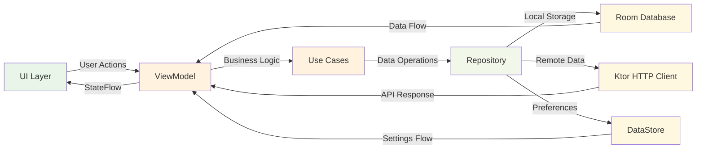
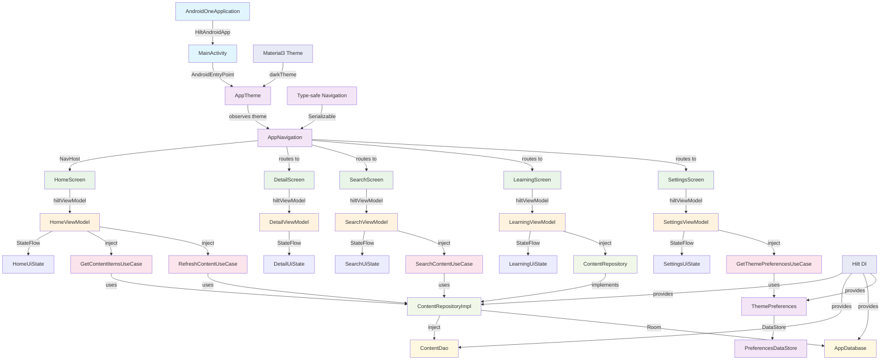
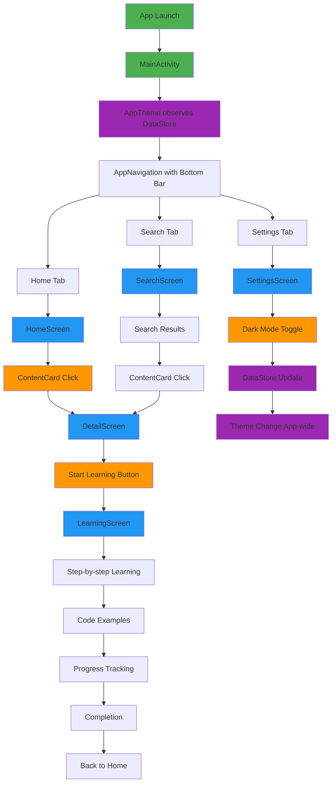

# Building AndroidOne: Modern Android Development Guide 2025

**Complete Step-by-Step Tutorial: From Empty Project to Production App**

This guide documents building AndroidOne, a comprehensive Android learning platform using modern 2025 best practices. Follow these exact steps to create a production-ready app with MVVM architecture, Jetpack Compose, Hilt DI, Room database, and Material 3 design.

## Technologies, Libraries & Frameworks Used

### 🏗️ **Core Android Technologies**

| Technology | Version | Purpose |
|------------|---------|---------|
| **Kotlin** | 2.0.21 | Modern programming language for Android with null safety, coroutines, and concise syntax |
| **Android Gradle Plugin** | 8.11.0 | Build system for Android applications with dependency management |
| **Compile SDK** | 35 (Android 15) | Latest Android API level for access to newest features |
| **Min SDK** | 24 (Android 7.0) | Minimum supported Android version for broad device compatibility |

### 🎨 **UI Framework & Design**

| Library | Version | Purpose |
|---------|---------|---------|
| **Jetpack Compose** | 2025.05.01 BOM | Modern declarative UI toolkit for building native Android UI |
| **Material 3** | Latest | Google's latest design system with dynamic colors and updated components |
| **Compose Activity** | 1.10.1 | Integration between Jetpack Compose and Android Activities |
| **Compose UI** | BOM | Core Compose UI components for building interfaces |
| **Compose UI Graphics** | BOM | Graphics utilities for custom drawing and effects |
| **Compose UI Tooling** | BOM | Development tools for Compose preview and debugging |

**Why Jetpack Compose?**
- **Declarative UI**: Describe what the UI should look like, not how to achieve it
- **Less boilerplate**: Significantly reduces code compared to XML layouts
- **Better performance**: Optimized recomposition and state management
- **Modern approach**: Industry standard for new Android development

### 🏛️ **Architecture Components**

| Library | Version | Purpose |
|---------|---------|---------|
| **Lifecycle Runtime KTX** | 2.9.1 | Lifecycle-aware components and coroutine integration |
| **ViewModel Compose** | 2.9.1 | ViewModel integration with Jetpack Compose |
| **Lifecycle Runtime Compose** | 2.9.1 | Lifecycle utilities specifically for Compose |

**Why MVVM Architecture?**
- **Separation of concerns**: UI logic separated from business logic
- **Testability**: ViewModels can be unit tested independently
- **Lifecycle awareness**: Automatic handling of configuration changes
- **Data binding**: Reactive UI updates with StateFlow

### 💉 **Dependency Injection**

| Library | Version | Purpose |
|---------|---------|---------|
| **Hilt Android** | 2.52 | Dependency injection framework built on top of Dagger |
| **Hilt Compiler** | 2.52 | Annotation processor for generating DI code |
| **Hilt Navigation Compose** | 1.2.0 | Integration between Hilt and Jetpack Navigation |

**Why Hilt?**
- **Simplified DI**: Reduces boilerplate compared to manual Dagger setup
- **Android integration**: Built specifically for Android lifecycle components
- **Compile-time safety**: Dependency graph validated at build time
- **Testing support**: Easy dependency replacement for testing

### 🗄️ **Database & Storage**

| Library | Version | Purpose |
|---------|---------|---------|
| **Room Runtime** | 2.6.1 | SQLite object mapping library for local database |
| **Room KTX** | 2.6.1 | Kotlin extensions and coroutine support for Room |
| **Room Compiler** | 2.6.1 | Annotation processor for generating Room database code |
| **DataStore Preferences** | 1.1.1 | Type-safe data storage for user preferences |

**Why Room Database?**
- **Type safety**: Compile-time verification of SQL queries
- **Reactive queries**: Automatic UI updates when data changes with Flow
- **Migration support**: Structured database schema evolution
- **Offline-first**: Local data storage for better user experience

**Why DataStore?**
- **Type safety**: Structured data storage with Kotlin serialization
- **Coroutine support**: Async operations with proper error handling
- **Preferences replacement**: Modern alternative to SharedPreferences
- **Consistency**: ACID guarantees for data integrity

### 🔄 **Asynchronous Programming**

| Library | Version | Purpose |
|---------|---------|---------|
| **Kotlinx Coroutines Android** | 1.8.1 | Asynchronous programming with structured concurrency |
| **Kotlinx Coroutines Test** | 1.8.1 | Testing utilities for coroutine-based code |

**Why Coroutines?**
- **Lightweight threads**: Efficient concurrent programming
- **Structured concurrency**: Automatic cancellation and error handling
- **Sequential code**: Write async code that looks synchronous
- **Android integration**: Built-in support for lifecycle scoping

### 🌐 **Networking**

| Library | Version | Purpose |
|---------|---------|---------|
| **Ktor Client Core** | 3.0.1 | HTTP client for making network requests |
| **Ktor Client OkHttp** | 3.0.1 | OkHttp engine for Ktor client |
| **Ktor Content Negotiation** | 3.0.1 | Automatic serialization/deserialization of request/response |
| **Ktor Serialization JSON** | 3.0.1 | JSON serialization support for Ktor |
| **Ktor Client Logging** | 3.0.1 | HTTP request/response logging for debugging |

**Why Ktor?**
- **Kotlin-first**: Built specifically for Kotlin with coroutine support
- **Multiplatform**: Can be shared between Android and other platforms
- **Type safety**: Strong typing for requests and responses
- **Flexibility**: Highly configurable with plugin system

### 🧭 **Navigation**

| Library | Version | Purpose |
|---------|---------|---------|
| **Navigation Compose** | 2.8.4 | Type-safe navigation between Compose screens |
| **Kotlinx Serialization JSON** | 1.7.3 | Serialization for navigation arguments |

**Why Navigation Compose?**
- **Type safety**: Compile-time verification of navigation arguments
- **Deep linking**: Automatic handling of external links
- **Back stack management**: Proper handling of back navigation
- **Animation support**: Smooth transitions between screens

### 🔒 **Serialization & Security**

| Library | Version | Purpose |
|---------|---------|---------|
| **Kotlinx Serialization** | 1.7.3 | JSON serialization/deserialization |
| **Security Crypto** | 1.0.0 | Encryption utilities for sensitive data |

**Why Kotlinx Serialization?**
- **Kotlin integration**: Native Kotlin support with better performance
- **Type safety**: Compile-time verification of serializable classes
- **Multiplatform**: Consistent serialization across platforms
- **Flexibility**: Support for various formats (JSON, protobuf, etc.)

### 🧪 **Testing**

| Library | Version | Purpose |
|---------|---------|---------|
| **JUnit** | 4.13.2 | Unit testing framework for Java/Kotlin |
| **AndroidX JUnit** | 1.2.1 | Android-specific testing utilities |
| **Espresso Core** | 3.6.1 | UI testing framework for Android |
| **Compose UI Test JUnit4** | BOM | Testing utilities specifically for Compose UI |
| **Mockito Core** | 5.8.0 | Mocking framework for unit tests |
| **Mockito Kotlin** | 5.2.1 | Kotlin extensions for Mockito |
| **Arch Core Testing** | 2.2.0 | Testing utilities for Architecture Components |

**Why This Testing Stack?**
- **Unit tests**: Fast, isolated testing of business logic
- **UI tests**: Automated testing of user interactions
- **Mocking**: Isolation of dependencies for reliable tests
- **Architecture testing**: Specific support for ViewModels and LiveData

### 🛠️ **Development Tools**

| Tool | Version | Purpose |
|------|---------|---------|
| **Kotlin Compose Compiler** | 2.0.21 | Compiler plugin for Jetpack Compose |
| **Kotlin Serialization Plugin** | 2.0.21 | Compiler plugin for kotlinx.serialization |
| **Kotlin KAPT** | 2.0.21 | Annotation processing for Kotlin |

### 📱 **Key Architecture Patterns**

| Pattern | Implementation | Benefit |
|---------|----------------|---------|
| **MVVM** | ViewModel + StateFlow + Compose | Reactive UI with clear separation of concerns |
| **Repository Pattern** | ContentRepository interface + implementation | Data source abstraction and offline-first architecture |
| **Use Cases** | Single responsibility business logic | Testable and reusable business operations |
| **Dependency Injection** | Hilt modules and providers | Loose coupling and easier testing |
| **Reactive Programming** | StateFlow + Flow + Compose | Automatic UI updates when data changes |
| **Clean Architecture** | Domain/Data/Presentation layers | Maintainable and scalable code structure |

### 🔄 **Data Flow Architecture**



### 💡 **Why These Technology Choices?**

1. **Future-Proof**: All libraries are actively maintained and represent the latest Android best practices
2. **Performance**: Optimized for efficiency with features like Compose recomposition and Room query optimization
3. **Developer Experience**: Reduced boilerplate, better debugging tools, and comprehensive documentation
4. **Industry Standard**: These are the technologies used by leading Android development teams
5. **Testability**: Every component is designed to be easily unit tested and mocked
6. **Scalability**: Architecture supports growth from small apps to large, complex applications

This technology stack provides a solid foundation for modern Android development in 2025 and beyond.

## Final App Architecture



## Navigation Flow



## Table of Contents

1. [Project Setup](#1-project-setup)
2. [Dependencies Configuration](#2-dependencies-configuration)
3. [Application Architecture](#3-application-architecture)
4. [Domain Layer](#4-domain-layer)
5. [Data Layer](#5-data-layer)
6. [Dependency Injection](#6-dependency-injection)
7. [UI Layer](#7-ui-layer)
8. [Navigation System](#8-navigation-system)
9. [Theme & Preferences](#9-theme--preferences)
10. [Testing](#10-testing)

---

## 1. Project Setup

### Step 1.1: Create New Android Project

1. **Open Android Studio**
2. **Create New Project** → **Empty Activity**
3. **Configure:**
   - Name: `AndroidOne`
   - Package: `com.rr.adone`
   - Language: `Kotlin`
   - Minimum SDK: `API 24`
   - Build configuration: `Kotlin DSL`

### Step 1.2: Project Structure Setup

Create the following directory structure:

```
app/src/main/java/com/rr/adone/
├── AndroidOneApplication.kt
├── MainActivity.kt
├── data/
│   ├── local/
│   │   ├── AppDatabase.kt
│   │   └── dao/
│   │       └── ContentDao.kt
│   ├── preferences/
│   │   └── ThemePreferences.kt
│   └── repository/
│       └── ContentRepositoryImpl.kt
├── di/
│   ├── DatabaseModule.kt
│   ├── PreferencesModule.kt
│   └── RepositoryModule.kt
├── domain/
│   ├── model/
│   │   └── ContentItem.kt
│   ├── repository/
│   │   └── ContentRepository.kt
│   └── usecase/
│       ├── GetContentItemsUseCase.kt
│       ├── GetThemePreferencesUseCase.kt
│       ├── RefreshContentUseCase.kt
│       └── SearchContentUseCase.kt
├── navigation/
│   └── NavigationDestinations.kt
└── ui/
    ├── navigation/
    │   └── AppNavigation.kt
    ├── screens/
    │   ├── detail/
    │   │   ├── DetailScreen.kt
    │   │   └── DetailViewModel.kt
    │   ├── home/
    │   │   ├── ContentCard.kt
    │   │   ├── HomeScreen.kt
    │   │   ├── HomeUiState.kt
    │   │   └── HomeViewModel.kt
    │   ├── learning/
    │   │   ├── LearningScreen.kt
    │   │   └── LearningViewModel.kt
    │   ├── search/
    │   │   ├── SearchScreen.kt
    │   │   └── SearchViewModel.kt
    │   └── settings/
    │       ├── SettingsScreen.kt
    │       └── SettingsViewModel.kt
    └── theme/
        ├── AppTheme.kt
        ├── Color.kt
        ├── Theme.kt
        └── Type.kt
```

---

## 2. Dependencies Configuration

### Step 2.1: Version Catalog Setup

Create `gradle/libs.versions.toml`:

```toml
[versions]
agp = "8.11.0"
kotlin = "2.0.21"
coreKtx = "1.16.0"
junit = "4.13.2"
junitVersion = "1.2.1"
espressoCore = "3.6.1"
lifecycleRuntimeKtx = "2.9.1"
activityCompose = "1.10.1"
composeBom = "2025.05.01"
hilt = "2.52"
room = "2.6.1"
coroutines = "1.8.1"
ktor = "3.0.1"
navigation = "2.8.4"
serialization = "1.7.3"
datastore = "1.1.1"
security = "1.0.0"
mockito = "5.8.0"
archCore = "2.2.0"

[libraries]
androidx-core-ktx = { group = "androidx.core", name = "core-ktx", version.ref = "coreKtx" }
junit = { group = "junit", name = "junit", version.ref = "junit" }
androidx-junit = { group = "androidx.test.ext", name = "junit", version.ref = "junitVersion" }
androidx-espresso-core = { group = "androidx.test.espresso", name = "espresso-core", version.ref = "espressoCore" }
androidx-lifecycle-runtime-ktx = { group = "androidx.lifecycle", name = "lifecycle-runtime-ktx", version.ref = "lifecycleRuntimeKtx" }
androidx-activity-compose = { group = "androidx.activity", name = "activity-compose", version.ref = "activityCompose" }
androidx-compose-bom = { group = "androidx.compose", name = "compose-bom", version.ref = "composeBom" }
androidx-ui = { group = "androidx.compose.ui", name = "ui" }
androidx-ui-graphics = { group = "androidx.compose.ui", name = "ui-graphics" }
androidx-ui-tooling = { group = "androidx.compose.ui", name = "ui-tooling" }
androidx-ui-tooling-preview = { group = "androidx.compose.ui", name = "ui-tooling-preview" }
androidx-ui-test-manifest = { group = "androidx.compose.ui", name = "ui-test-manifest" }
androidx-ui-test-junit4 = { group = "androidx.compose.ui", name = "ui-test-junit4" }
androidx-material3 = { group = "androidx.compose.material3", name = "material3" }

# Lifecycle and ViewModel
androidx-lifecycle-viewmodel-compose = { group = "androidx.lifecycle", name = "lifecycle-viewmodel-compose", version.ref = "lifecycleRuntimeKtx" }
androidx-lifecycle-runtime-compose = { group = "androidx.lifecycle", name = "lifecycle-runtime-compose", version.ref = "lifecycleRuntimeKtx" }

# Hilt Dependency Injection
hilt-android = { group = "com.google.dagger", name = "hilt-android", version.ref = "hilt" }
hilt-compiler = { group = "com.google.dagger", name = "hilt-compiler", version.ref = "hilt" }
hilt-navigation-compose = { group = "androidx.hilt", name = "hilt-navigation-compose", version = "1.2.0" }

# Room Database
room-runtime = { group = "androidx.room", name = "room-runtime", version.ref = "room" }
room-ktx = { group = "androidx.room", name = "room-ktx", version.ref = "room" }
room-compiler = { group = "androidx.room", name = "room-compiler", version.ref = "room" }

# Coroutines
kotlinx-coroutines-android = { group = "org.jetbrains.kotlinx", name = "kotlinx-coroutines-android", version.ref = "coroutines" }
kotlinx-coroutines-test = { group = "org.jetbrains.kotlinx", name = "kotlinx-coroutines-test", version.ref = "coroutines" }

# Ktor for networking
ktor-client-core = { group = "io.ktor", name = "ktor-client-core", version.ref = "ktor" }
ktor-client-okhttp = { group = "io.ktor", name = "ktor-client-okhttp", version.ref = "ktor" }
ktor-client-content-negotiation = { group = "io.ktor", name = "ktor-client-content-negotiation", version.ref = "ktor" }
ktor-serialization-kotlinx-json = { group = "io.ktor", name = "ktor-serialization-kotlinx-json", version.ref = "ktor" }
ktor-client-logging = { group = "io.ktor", name = "ktor-client-logging", version.ref = "ktor" }

# Navigation
androidx-navigation-compose = { group = "androidx.navigation", name = "navigation-compose", version.ref = "navigation" }

# Kotlinx Serialization
kotlinx-serialization-json = { group = "org.jetbrains.kotlinx", name = "kotlinx-serialization-json", version.ref = "serialization" }

# DataStore
androidx-datastore-preferences = { group = "androidx.datastore", name = "datastore-preferences", version.ref = "datastore" }

# Security
androidx-security-crypto = { group = "androidx.security", name = "security-crypto", version.ref = "security" }

# Testing
mockito-core = { group = "org.mockito", name = "mockito-core", version.ref = "mockito" }
mockito-kotlin = { group = "org.mockito.kotlin", name = "mockito-kotlin", version = "5.2.1" }
androidx-arch-core-testing = { group = "androidx.arch.core", name = "core-testing", version.ref = "archCore" }

[plugins]
android-application = { id = "com.android.application", version.ref = "agp" }
kotlin-android = { id = "org.jetbrains.kotlin.android", version.ref = "kotlin" }
kotlin-compose = { id = "org.jetbrains.kotlin.plugin.compose", version.ref = "kotlin" }
kotlin-serialization = { id = "org.jetbrains.kotlin.plugin.serialization", version.ref = "kotlin" }
hilt-android = { id = "com.google.dagger.hilt.android", version.ref = "hilt" }
kotlin-kapt = { id = "org.jetbrains.kotlin.kapt", version.ref = "kotlin" }
```

### Step 2.2: App Build Configuration

Update `app/build.gradle.kts`:

```kotlin
plugins {
    alias(libs.plugins.android.application)
    alias(libs.plugins.kotlin.android)
    alias(libs.plugins.kotlin.compose)
    alias(libs.plugins.kotlin.serialization)
    alias(libs.plugins.hilt.android)
    alias(libs.plugins.kotlin.kapt)
}

android {
    namespace = "com.rr.adone"
    compileSdk = 35

    defaultConfig {
        applicationId = "com.rr.adone"
        minSdk = 24
        targetSdk = 35
        versionCode = 1
        versionName = "1.0"

        testInstrumentationRunner = "androidx.test.runner.AndroidJUnitRunner"
    }

    buildTypes {
        release {
            isMinifyEnabled = false
            proguardFiles(
                getDefaultProguardFile("proguard-android-optimize.txt"),
                "proguard-rules.pro"
            )
        }
    }
    compileOptions {
        sourceCompatibility = JavaVersion.VERSION_11
        targetCompatibility = JavaVersion.VERSION_11
    }
    kotlinOptions {
        jvmTarget = "11"
        languageVersion = "2.0"
    }
    buildFeatures {
        compose = true
    }
}

dependencies {
    // Core Android
    implementation(libs.androidx.core.ktx)
    implementation(libs.androidx.lifecycle.runtime.ktx)
    implementation(libs.androidx.activity.compose)
    
    // Compose BOM
    implementation(platform(libs.androidx.compose.bom))
    implementation(libs.androidx.ui)
    implementation(libs.androidx.ui.graphics)
    implementation(libs.androidx.ui.tooling.preview)
    implementation(libs.androidx.material3)
    
    // Lifecycle and ViewModel
    implementation(libs.androidx.lifecycle.viewmodel.compose)
    implementation(libs.androidx.lifecycle.runtime.compose)
    
    // Hilt Dependency Injection
    implementation(libs.hilt.android)
    kapt(libs.hilt.compiler)
    implementation(libs.hilt.navigation.compose)
    
    // Room Database
    implementation(libs.room.runtime)
    implementation(libs.room.ktx)
    kapt(libs.room.compiler)
    
    // Coroutines
    implementation(libs.kotlinx.coroutines.android)
    
    // Ktor Networking
    implementation(libs.ktor.client.core)
    implementation(libs.ktor.client.okhttp)
    implementation(libs.ktor.client.content.negotiation)
    implementation(libs.ktor.serialization.kotlinx.json)
    implementation(libs.ktor.client.logging)
    
    // Navigation
    implementation(libs.androidx.navigation.compose)
    
    // Kotlinx Serialization
    implementation(libs.kotlinx.serialization.json)
    
    // DataStore
    implementation(libs.androidx.datastore.preferences)
    
    // Testing
    testImplementation(libs.junit)
    testImplementation(libs.kotlinx.coroutines.test)
    androidTestImplementation(libs.androidx.junit)
    androidTestImplementation(libs.androidx.espresso.core)
    androidTestImplementation(platform(libs.androidx.compose.bom))
    androidTestImplementation(libs.androidx.ui.test.junit4)
    debugImplementation(libs.androidx.ui.tooling)
    debugImplementation(libs.androidx.ui.test.manifest)
}
```

---

## 3. Application Architecture

### Step 3.1: Application Class

Create `AndroidOneApplication.kt`:

```kotlin
package com.rr.adone

import android.app.Application
import dagger.hilt.android.HiltAndroidApp

@HiltAndroidApp
class AndroidOneApplication : Application()
```

### Step 3.2: Update AndroidManifest.xml

```xml
<application
    android:name=".AndroidOneApplication"
    android:allowBackup="true"
    android:dataExtractionRules="@xml/data_extraction_rules"
    android:fullBackupContent="@xml/backup_rules"
    android:icon="@mipmap/ic_launcher"
    android:label="@string/app_name"
    android:roundIcon="@mipmap/ic_launcher_round"
    android:supportsRtl="true"
    android:theme="@style/Theme.Adone"
    tools:targetApi="31">
    
    <activity
        android:name=".MainActivity"
        android:exported="true"
        android:theme="@style/Theme.Adone">
        <intent-filter>
            <action android:name="android.intent.action.MAIN" />
            <category android:name="android.intent.category.LAUNCHER" />
        </intent-filter>
    </activity>
</application>
```

---

## 4. Domain Layer

### Step 4.1: Content Model

Create `domain/model/ContentItem.kt`:

```kotlin
package com.rr.adone.domain.model

import androidx.room.Entity
import androidx.room.PrimaryKey
import kotlinx.serialization.Serializable

@Entity(tableName = "content_items")
@Serializable
data class ContentItem(
    @PrimaryKey val id: String,
    val title: String,
    val description: String,
    val category: String,
    val difficulty: String,
    val estimatedTime: String
)
```

### Step 4.2: Repository Interface

Create `domain/repository/ContentRepository.kt`:

```kotlin
package com.rr.adone.domain.repository

import com.rr.adone.domain.model.ContentItem
import kotlinx.coroutines.flow.Flow

interface ContentRepository {
    fun getContentItemsFlow(): Flow<List<ContentItem>>
    suspend fun getContentItems(): List<ContentItem>
    suspend fun getContentItem(id: String): ContentItem?
    fun searchContent(query: String): Flow<List<ContentItem>>
    suspend fun refreshContentItems()
    suspend fun createContentItem(item: ContentItem): ContentItem
    suspend fun updateContentItem(item: ContentItem): ContentItem
    suspend fun deleteContentItem(id: String): Boolean
}
```

### Step 4.3: Use Cases

Create `domain/usecase/GetContentItemsUseCase.kt`:

```kotlin
package com.rr.adone.domain.usecase

import com.rr.adone.domain.model.ContentItem
import com.rr.adone.domain.repository.ContentRepository
import kotlinx.coroutines.flow.Flow
import javax.inject.Inject

class GetContentItemsUseCase @Inject constructor(
    private val contentRepository: ContentRepository
) {
    operator fun invoke(): Flow<List<ContentItem>> {
        return contentRepository.getContentItemsFlow()
    }
}
```

Create similar files for:
- `RefreshContentUseCase.kt`
- `SearchContentUseCase.kt`
- `GetThemePreferencesUseCase.kt`

---

## 5. Data Layer

### Step 5.1: Room Database Setup

Create `data/local/dao/ContentDao.kt`:

```kotlin
package com.rr.adone.data.local.dao

import androidx.room.*
import com.rr.adone.domain.model.ContentItem
import kotlinx.coroutines.flow.Flow

@Dao
interface ContentDao {
    
    @Query("SELECT * FROM content_items ORDER BY title ASC")
    fun getAllContentFlow(): Flow<List<ContentItem>>
    
    @Query("SELECT * FROM content_items ORDER BY title ASC")
    suspend fun getAllContent(): List<ContentItem>
    
    @Query("SELECT * FROM content_items WHERE id = :id")
    suspend fun getContentById(id: String): ContentItem?
    
    @Query("SELECT * FROM content_items WHERE title LIKE '%' || :query || '%' OR description LIKE '%' || :query || '%'")
    fun searchContent(query: String): Flow<List<ContentItem>>
    
    @Insert(onConflict = OnConflictStrategy.REPLACE)
    suspend fun insertContent(item: ContentItem)
    
    @Insert(onConflict = OnConflictStrategy.REPLACE)
    suspend fun insertContentItems(items: List<ContentItem>)
    
    @Update
    suspend fun updateContent(item: ContentItem)
    
    @Delete
    suspend fun deleteContent(item: ContentItem)
    
    @Query("DELETE FROM content_items")
    suspend fun deleteAllContent()
    
    @Query("SELECT COUNT(*) FROM content_items")
    suspend fun getContentCount(): Int
}
```

Create `data/local/AppDatabase.kt`:

```kotlin
package com.rr.adone.data.local

import androidx.room.Database
import androidx.room.RoomDatabase
import com.rr.adone.data.local.dao.ContentDao
import com.rr.adone.domain.model.ContentItem

@Database(
    entities = [ContentItem::class],
    version = 1,
    exportSchema = false
)
abstract class AppDatabase : RoomDatabase() {
    abstract fun contentDao(): ContentDao
}
```

### Step 5.2: Repository Implementation

Create `data/repository/ContentRepositoryImpl.kt` with comprehensive sample data for 12 Android development topics.

### Step 5.3: Preferences Setup

Create `data/preferences/ThemePreferences.kt`:

```kotlin
package com.rr.adone.data.preferences

import android.content.Context
import androidx.datastore.core.DataStore
import androidx.datastore.preferences.core.Preferences
import androidx.datastore.preferences.core.booleanPreferencesKey
import androidx.datastore.preferences.core.edit
import androidx.datastore.preferences.preferencesDataStore
import dagger.hilt.android.qualifiers.ApplicationContext
import kotlinx.coroutines.flow.Flow
import kotlinx.coroutines.flow.map
import javax.inject.Inject
import javax.inject.Singleton

private val Context.dataStore: DataStore<Preferences> by preferencesDataStore(name = "theme_preferences")

@Singleton
class ThemePreferences @Inject constructor(
    @ApplicationContext private val context: Context
) {
    private val isDarkModeKey = booleanPreferencesKey("is_dark_mode")
    private val notificationsEnabledKey = booleanPreferencesKey("notifications_enabled")

    val isDarkMode: Flow<Boolean> = context.dataStore.data
        .map { preferences ->
            preferences[isDarkModeKey] ?: false
        }

    val notificationsEnabled: Flow<Boolean> = context.dataStore.data
        .map { preferences ->
            preferences[notificationsEnabledKey] ?: true
        }

    suspend fun setDarkMode(enabled: Boolean) {
        context.dataStore.edit { preferences ->
            preferences[isDarkModeKey] = enabled
        }
    }

    suspend fun setNotificationsEnabled(enabled: Boolean) {
        context.dataStore.edit { preferences ->
            preferences[notificationsEnabledKey] = enabled
        }
    }
}
```

---

## 6. Dependency Injection

### Step 6.1: Database Module

Create `di/DatabaseModule.kt`:

```kotlin
package com.rr.adone.di

import android.content.Context
import androidx.room.Room
import com.rr.adone.data.local.AppDatabase
import com.rr.adone.data.local.dao.ContentDao
import dagger.Module
import dagger.Provides
import dagger.hilt.InstallIn
import dagger.hilt.android.qualifiers.ApplicationContext
import dagger.hilt.components.SingletonComponent
import javax.inject.Singleton

@Module
@InstallIn(SingletonComponent::class)
object DatabaseModule {

    @Provides
    @Singleton
    fun provideAppDatabase(@ApplicationContext context: Context): AppDatabase {
        return Room.databaseBuilder(
            context,
            AppDatabase::class.java,
            "androidone_database"
        )
            .fallbackToDestructiveMigration()
            .build()
    }

    @Provides
    fun provideContentDao(database: AppDatabase): ContentDao {
        return database.contentDao()
    }
}
```

### Step 6.2: Repository Module

Create `di/RepositoryModule.kt`:

```kotlin
package com.rr.adone.di

import com.rr.adone.data.repository.ContentRepositoryImpl
import com.rr.adone.domain.repository.ContentRepository
import dagger.Binds
import dagger.Module
import dagger.hilt.InstallIn
import dagger.hilt.components.SingletonComponent
import javax.inject.Singleton

@Module
@InstallIn(SingletonComponent::class)
abstract class RepositoryModule {

    @Binds
    @Singleton
    abstract fun bindContentRepository(
        contentRepositoryImpl: ContentRepositoryImpl
    ): ContentRepository
}
```

### Step 6.3: Preferences Module

Create `di/PreferencesModule.kt`:

```kotlin
package com.rr.adone.di

import android.content.Context
import com.rr.adone.data.preferences.ThemePreferences
import dagger.Module
import dagger.Provides
import dagger.hilt.InstallIn
import dagger.hilt.android.qualifiers.ApplicationContext
import dagger.hilt.components.SingletonComponent
import javax.inject.Singleton

@Module
@InstallIn(SingletonComponent::class)
object PreferencesModule {

    @Provides
    @Singleton
    fun provideThemePreferences(@ApplicationContext context: Context): ThemePreferences {
        return ThemePreferences(context)
    }
}
```

---

## 7. UI Layer

### Step 7.1: Navigation Setup

Create `navigation/NavigationDestinations.kt`:

```kotlin
package com.rr.adone.navigation

import kotlinx.serialization.Serializable

@Serializable
sealed class NavigationDestination {
    @Serializable
    data object Home : NavigationDestination()
    
    @Serializable
    data object Search : NavigationDestination()
    
    @Serializable
    data class Detail(val contentId: String) : NavigationDestination()
    
    @Serializable
    data class Learning(val contentId: String) : NavigationDestination()
    
    @Serializable
    data object Settings : NavigationDestination()
}
```

### Step 7.2: Theme System

Create `ui/theme/AppTheme.kt`:

```kotlin
package com.rr.adone.ui.theme

import androidx.compose.foundation.isSystemInDarkTheme
import androidx.compose.runtime.*
import androidx.compose.ui.platform.LocalContext
import androidx.hilt.navigation.compose.hiltViewModel
import com.rr.adone.domain.usecase.GetThemePreferencesUseCase

@Composable
fun AppTheme(
    content: @Composable () -> Unit
) {
    val context = LocalContext.current
    val systemInDarkTheme = isSystemInDarkTheme()
    
    val themeViewModel: AppThemeViewModel = hiltViewModel()
    val isDarkMode by themeViewModel.isDarkMode.collectAsState(initial = systemInDarkTheme)
    
    AdoneTheme(
        darkTheme = isDarkMode,
        content = content
    )
}

@dagger.hilt.android.lifecycle.HiltViewModel
class AppThemeViewModel @javax.inject.Inject constructor(
    private val getThemePreferencesUseCase: GetThemePreferencesUseCase
) : androidx.lifecycle.ViewModel() {
    
    val isDarkMode = getThemePreferencesUseCase.isDarkMode()
}
```

### Step 7.3: MVVM Implementation

For each screen, implement the MVVM pattern:

1. **UiState data class** - represents screen state
2. **ViewModel** - manages business logic and state
3. **Composable screen** - UI that observes state

Example for HomeScreen:

```kotlin
// HomeUiState.kt
data class HomeUiState(
    val items: List<ContentItem> = emptyList(),
    val isLoading: Boolean = false,
    val error: String? = null,
    val isRefreshing: Boolean = false
)

// HomeViewModel.kt
@HiltViewModel
class HomeViewModel @Inject constructor(
    private val getContentItemsUseCase: GetContentItemsUseCase,
    private val refreshContentUseCase: RefreshContentUseCase
) : ViewModel() {

    private val _uiState = MutableStateFlow(HomeUiState())
    val uiState: StateFlow<HomeUiState> = _uiState.asStateFlow()

    init {
        loadContent()
        onRefresh()
    }
    
    // Implementation details...
}

// HomeScreen.kt
@OptIn(ExperimentalMaterial3Api::class)
@Composable
fun HomeScreen(
    onNavigateToDetail: (String) -> Unit = {},
    onNavigateToSearch: () -> Unit = {},
    modifier: Modifier = Modifier,
    viewModel: HomeViewModel = hiltViewModel()
) {
    val uiState by viewModel.uiState.collectAsState()
    
    // UI implementation with Scaffold, TopAppBar, PullToRefreshBox...
}
```

---

## 8. Navigation System

### Step 8.1: App Navigation Component

Create `ui/navigation/AppNavigation.kt`:

```kotlin
package com.rr.adone.ui.navigation

import androidx.compose.foundation.layout.fillMaxSize
import androidx.compose.foundation.layout.padding
import androidx.compose.material.icons.Icons
import androidx.compose.material.icons.filled.Home
import androidx.compose.material.icons.filled.Search
import androidx.compose.material.icons.filled.Settings
import androidx.compose.material3.*
import androidx.compose.runtime.*
import androidx.compose.ui.Modifier
import androidx.compose.ui.graphics.vector.ImageVector
import androidx.navigation.NavDestination.Companion.hasRoute
import androidx.navigation.NavDestination.Companion.hierarchy
import androidx.navigation.NavHostController
import androidx.navigation.compose.NavHost
import androidx.navigation.compose.composable
import androidx.navigation.compose.currentBackStackEntryAsState
import androidx.navigation.compose.rememberNavController
import androidx.navigation.toRoute
import com.rr.adone.navigation.NavigationDestination
// Import all screen composables...

@Composable
fun AppNavigation(
    modifier: Modifier = Modifier,
    navController: NavHostController = rememberNavController()
) {
    val navBackStackEntry by navController.currentBackStackEntryAsState()
    val currentDestination = navBackStackEntry?.destination
    
    val bottomBarRoutes = listOf(
        NavigationDestination.Home,
        NavigationDestination.Search,
        NavigationDestination.Settings
    )
    
    val shouldShowBottomBar = bottomBarRoutes.any { route ->
        currentDestination?.hierarchy?.any { it.hasRoute(route::class) } == true
    }
    
    Scaffold(
        modifier = modifier.fillMaxSize(),
        bottomBar = {
            if (shouldShowBottomBar) {
                NavigationBar {
                    bottomBarDestinations.forEach { destination ->
                        NavigationBarItem(
                            icon = { Icon(destination.icon, contentDescription = destination.label) },
                            label = { Text(destination.label) },
                            selected = currentDestination?.hierarchy?.any { 
                                it.hasRoute(destination.route::class) 
                            } == true,
                            onClick = {
                                navController.navigate(destination.route) {
                                    popUpTo(NavigationDestination.Home) {
                                        saveState = true
                                    }
                                    launchSingleTop = true
                                    restoreState = true
                                }
                            }
                        )
                    }
                }
            }
        }
    ) { paddingValues ->
        NavHost(
            navController = navController,
            startDestination = NavigationDestination.Home,
            modifier = Modifier.padding(paddingValues)
        ) {
            composable<NavigationDestination.Home> {
                HomeScreen(
                    onNavigateToDetail = { contentId ->
                        navController.navigate(NavigationDestination.Detail(contentId))
                    },
                    onNavigateToSearch = {
                        navController.navigate(NavigationDestination.Search)
                    }
                )
            }
            
            composable<NavigationDestination.Search> {
                SearchScreen(
                    onNavigateBack = {
                        navController.popBackStack()
                    },
                    onNavigateToDetail = { contentId ->
                        navController.navigate(NavigationDestination.Detail(contentId))
                    }
                )
            }
            
            composable<NavigationDestination.Detail> { backStackEntry ->
                val detail: NavigationDestination.Detail = backStackEntry.toRoute()
                DetailScreen(
                    contentId = detail.contentId,
                    onNavigateBack = {
                        navController.popBackStack()
                    },
                    onStartLearning = { contentId ->
                        navController.navigate(NavigationDestination.Learning(contentId))
                    }
                )
            }
            
            composable<NavigationDestination.Learning> { backStackEntry ->
                val learning: NavigationDestination.Learning = backStackEntry.toRoute()
                LearningScreen(
                    contentId = learning.contentId,
                    onNavigateBack = {
                        navController.popBackStack()
                    }
                )
            }
            
            composable<NavigationDestination.Settings> {
                SettingsScreen(
                    onNavigateBack = {
                        navController.popBackStack()
                    }
                )
            }
        }
    }
}

private data class BottomBarDestination(
    val route: NavigationDestination,
    val icon: ImageVector,
    val label: String
)

private val bottomBarDestinations = listOf(
    BottomBarDestination(
        route = NavigationDestination.Home,
        icon = Icons.Default.Home,
        label = "Home"
    ),
    BottomBarDestination(
        route = NavigationDestination.Search,
        icon = Icons.Default.Search,
        label = "Search"
    ),
    BottomBarDestination(
        route = NavigationDestination.Settings,
        icon = Icons.Default.Settings,
        label = "Settings"
    )
)
```

### Step 8.2: MainActivity Integration

Update `MainActivity.kt`:

```kotlin
package com.rr.adone

import android.os.Bundle
import androidx.activity.ComponentActivity
import androidx.activity.compose.setContent
import androidx.activity.enableEdgeToEdge
import com.rr.adone.ui.navigation.AppNavigation
import com.rr.adone.ui.theme.AppTheme
import dagger.hilt.android.AndroidEntryPoint

@AndroidEntryPoint
class MainActivity : ComponentActivity() {
    override fun onCreate(savedInstanceState: Bundle?) {
        super.onCreate(savedInstanceState)
        enableEdgeToEdge()
        setContent {
            AppTheme {
                AppNavigation()
            }
        }
    }
}
```

---

## 9. Theme & Preferences

### Step 9.1: Dynamic Theme Implementation

The AppTheme component observes DataStore preferences and updates the entire app theme in real-time.

### Step 9.2: Settings Screen Implementation

Create a comprehensive settings screen with:
- Dark mode toggle with persistence
- Notifications toggle
- App information
- Action buttons for rating, sharing, feedback

### Step 9.3: Real-time Theme Updates

When users toggle dark mode in settings:
1. SettingsViewModel updates DataStore
2. AppTheme observes the change
3. Entire app re-themes instantly
4. Preference persists across app restarts

---

## 10. Learning System

### Step 10.1: Interactive Learning Sessions

Create comprehensive learning content for each Android development topic:

- **Step-by-step tutorials** with progress tracking
- **Code examples** with syntax highlighting
- **Category-specific content** (Architecture, UI/UX, Testing, etc.)
- **Completion system** with congratulations

### Step 10.2: Content Management

Generate dynamic learning steps based on content category:
- MVVM Architecture: StateFlow, Repository pattern, Clean Architecture
- Jetpack Compose: Fundamentals, State management, Material 3
- Testing: Unit tests, UI tests, TDD principles
- And more...

---

## 11. Testing

### Step 11.1: Unit Testing Setup

```kotlin
@Test
fun `when repository returns data, uiState should contain items`() = runTest {
    // Given
    val mockItems = listOf(ContentItem("1", "Test", "Description", "Category", "Beginner", "30 min"))
    `when`(repository.getContentItems()).thenReturn(flowOf(mockItems))
    
    // When
    viewModel.loadContent()
    
    // Then
    assertEquals(mockItems, viewModel.uiState.value.items)
}
```

### Step 11.2: UI Testing

```kotlin
@Test
fun contentCard_displaysCorrectly() {
    composeTestRule.setContent {
        ContentCard(
            item = testContentItem,
            onClick = { }
        )
    }
    
    composeTestRule
        .onNodeWithText("Test Title")
        .assertIsDisplayed()
}
```

---

## Final Features Overview

✅ **Complete MVVM Architecture** with StateFlow
✅ **Room Database** with offline-first pattern  
✅ **Hilt Dependency Injection** throughout
✅ **Type-safe Navigation** with Kotlinx Serialization
✅ **Material 3 Design** with dynamic theming
✅ **DataStore Preferences** for settings persistence
✅ **Interactive Learning System** with step-by-step tutorials
✅ **Pull-to-refresh** functionality
✅ **Search functionality** with real-time results
✅ **Dark mode** with app-wide theme switching
✅ **Bottom navigation** with multiple screens
✅ **Comprehensive content** for 12 Android development topics

## Key Android Concepts Demonstrated

1. **Modern Architecture**: Clean Architecture with Domain/Data/Presentation layers
2. **Reactive Programming**: StateFlow for state management
3. **Dependency Injection**: Hilt for clean, testable code
4. **Local Storage**: Room database with entities, DAOs, and repositories
5. **Navigation**: Type-safe navigation between screens
6. **UI Framework**: Jetpack Compose with Material 3
7. **Preferences**: DataStore for persistent settings
8. **Testing**: Unit and UI testing strategies
9. **Performance**: Offline-first architecture for better UX
10. **User Experience**: Interactive learning system with progress tracking

This guide represents a complete, production-ready Android application implementing all modern Android development best practices for 2025.